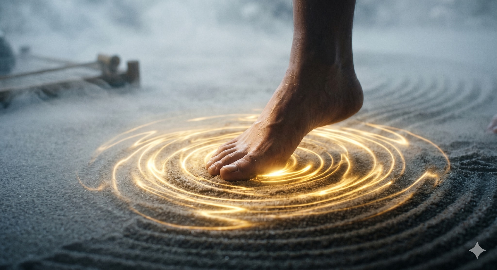

# BÍ MẬT BƯỚC CHÂN TRONG THÁI CỰC

> 📅 *May 27, 2026 4:57:49 pm* · 📸 1 ảnh · 🎬 0 video

[← Quay lại danh sách bài viết](../index.md)

---

Nhiều người bước đi
chỉ bằng đôi chân
làm thân bị động
lực bị ngắt quãng
Nhưng trong Thái Cực
bước chân là gốc
nơi kết nối đất trời

HƯ THỰC PHÂN MINH
Thái Cực Quyền Luận viết
Bước đi như mèo
Thân hình như kéo kén
Phải biết phân biệt
giữa Hư và Thực
Chân nào trụ (Thực)
Chân nào bước (Hư)
Âm Dương nằm ở đó

CHUYỂN ĐỘNG TỪ TRỌNG TÂM
Đừng dùng sức đùi
để đẩy người đi
Hãy để Hệ trục
di chuyển trước
Đan điền dẫn dắt
đôi chân chỉ việc
bước ra đỡ lấy
vận hành tự nhiên

TIẾP ĐẤT BA ĐIỂM
Khi chân chạm đất
hãy cảm nhận sâu
huyệt Dũng Tuyền
Mặt đất là nguồn
của mọi sức mạnh
Khí từ lòng đất
truyền qua gót chân
lên tận đỉnh đầu

THẢ LỎNG ĐỂ VỮNG CHÃI
Chân không được cứng
đầu gối phải lỏng
Khi khớp gối mở
Khí mới đi xuống
thân mới trung chính
Bước đi nhẹ nhàng
nhưng lực ngàn cân

CHO NÊN
Đi không phải là bước
mà là sự chuyển dịch
của một Hệ trục thẳng.
Gốc có vững
thì thân mới an.

Phạm Đức Hải | Thái Cực QuyềnBÍ MẬT BƯỚC CHÂN TRONG THÁI CỰCNhiều người bước đichỉ bằng đôi chânlàm thân bị độnglực bị ngắt quãngNhưng trong Thái Cựcbước chân là gốcnơi kết nối đất trờiHƯ THỰC PHÂN MINHThái Cực Quyền Luận viếtBước đi như mèoThân hình như kéo kénPhải biết phân biệtgiữa Hư và ThựcChân nào trụ (Thực)Chân nào bước (Hư)Âm Dương nằm ở đóCHUYỂN ĐỘNG TỪ TRỌNG TÂMĐừng dùng sức đùiđể đẩy người điHãy để Hệ trụcdi chuyển trướcĐan điền dẫn dắtđôi chân chỉ việcbước ra đỡ lấyvận hành tự nhiênTIẾP ĐẤT BA ĐIỂMKhi chân chạm đấthãy cảm nhận sâuhuyệt Dũng TuyềnMặt đất là nguồncủa mọi sức mạnhKhí từ lòng đấttruyền qua gót chânlên tận đỉnh đầuTHẢ LỎNG ĐỂ VỮNG CHÃIChân không được cứngđầu gối phải lỏngKhi khớp gối mởKhí mới đi xuốngthân mới trung chínhBước đi nhẹ nhàngnhưng lực ngàn cânCHO NÊNĐi không phải là bướcmà là sự chuyển dịchcủa một Hệ trục thẳng.Gốc có vữngthì thân mới an.Phạm Đức Hải | Thái Cực Quyền