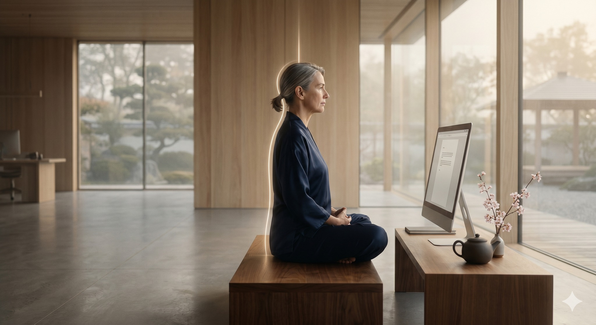

# BÍ MẬT HỆ TRỤC KHI NGỒI LÀM VIỆC

> 📅 *May 28, 2026 6:59:12 am* · 📸 1 ảnh · 🎬 0 video

[← Quay lại danh sách bài viết](../index.md)

---

Nhiều người ngồi lâu
thấy mỏi cổ vai
thấy lưng đau nhức
vì đang ép mình
vào một tư thế
không có điểm tựa
không có sự thông

VẬN HÀNH KHÔNG TẢI
Trong Thái Cực Quyền
Hệ trục là xương sống
là rường cột sinh mệnh
Nếu trục bị gãy
cơ bắp phải gồng
để giữ lấy thân
làm năng lượng cạn
làm khí huyết trệ

HƯ LINH ĐỈNH KÌNH
Hãy treo đỉnh đầu
như treo áo trên móc
Để các đốt sống
được giãn tự nhiên
không bị chèn ép
không bị bóp nghẹt
Dòng khí từ đó
mới thông lên não

VĨ LƯ TRUNG CHÍNH
Xương cùng hướng xuống
như có quả tạ
treo ở thắt lưng
Khi gốc đã vững
trục sẽ tự thẳng
Mọi áp lực nặng
đều được hóa giải
truyền thẳng xuống đất

THẢ LỎNG TRONG CẤU TRÚC
Đừng cố ngồi thẳng
bằng sức cơ bắp
Hãy ngồi thẳng
bằng sự xếp chồng
của các đốt xương
Khi xương đã gánh
thì cơ được lỏng
vận hành không tải

CHO NÊN
Mệt mỏi không phải
do làm việc nhiều.
Mà do bạn đang
sống lệch hệ trục.
Chỉnh lại cái trục
để thân được an.

Phạm Đức Hải | Thái Cực QuyềnBÍ MẬT HỆ TRỤC KHI NGỒI LÀM VIỆCNhiều người ngồi lâuthấy mỏi cổ vaithấy lưng đau nhứcvì đang ép mìnhvào một tư thếkhông có điểm tựakhông có sự thôngVẬN HÀNH KHÔNG TẢITrong Thái Cực QuyềnHệ trục là xương sốnglà rường cột sinh mệnhNếu trục bị gãycơ bắp phải gồngđể giữ lấy thânlàm năng lượng cạnlàm khí huyết trệHƯ LINH ĐỈNH KÌNHHãy treo đỉnh đầunhư treo áo trên mócĐể các đốt sốngđược giãn tự nhiênkhông bị chèn épkhông bị bóp nghẹtDòng khí từ đómới thông lên nãoVĨ LƯ TRUNG CHÍNHXương cùng hướng xuốngnhư có quả tạtreo ở thắt lưngKhi gốc đã vữngtrục sẽ tự thẳngMọi áp lực nặngđều được hóa giảitruyền thẳng xuống đấtTHẢ LỎNG TRONG CẤU TRÚCĐừng cố ngồi thẳngbằng sức cơ bắpHãy ngồi thẳngbằng sự xếp chồngcủa các đốt xươngKhi xương đã gánhthì cơ được lỏngvận hành không tảiCHO NÊNMệt mỏi không phảido làm việc nhiều.Mà do bạn đangsống lệch hệ trục.Chỉnh lại cái trụcđể thân được an.Phạm Đức Hải | Thái Cực Quyền