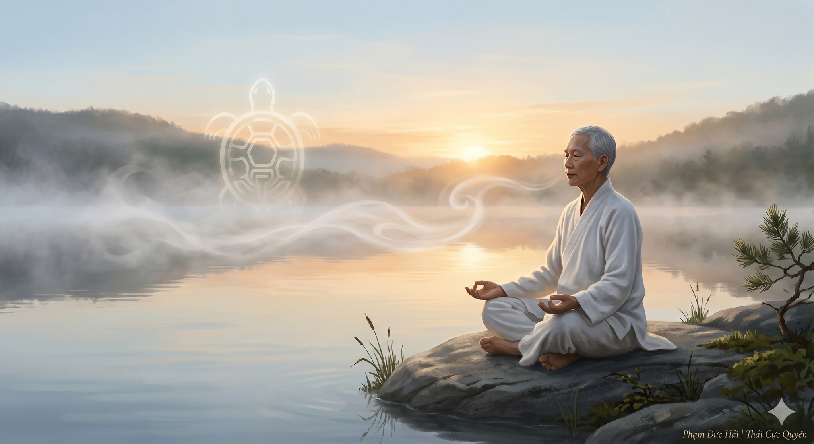

# BÍ MẬT HƠI THỞ RÙA TRONG DƯỠNG SINH

> 📅 *May 28, 2026 8:16:48 am* · 📸 1 ảnh · 🎬 0 video

[← Quay lại danh sách bài viết](../index.md)

---

Tại sao loài rùa
lại có thể sống
hàng trăm năm?
Bí mật nằm ở
nhịp điệu vận hành
của hơi thở bên trong   

HỌC THEO TRƯỜNG THỌ

Trong Đạo dẫn thuật
cổ nhân luôn dạy
học theo loài rùa 
Thở chậm và sâu
Thở êm và dài
Để bảo toàn năng lượng
Để dưỡng lấy tinh hoa  

THÂM TẾ TRƯỜNG DU

Hơi thở Quy tức
là bốn trạng thái:

- Thâm: sâu xuống tận gốc
- Tế: nhỏ nhẹ như tơ
- Trường: dài không đứt đoạn
- Du: thong dong tự tại

Giúp Khí được lắng xuống
nuôi dưỡng hạ Đan điền   

QUY TỨC VỀ GỐC

Đừng thở bằng ngực
Làm Tâm dễ xao động
Hãy đưa hơi thở
xuống vùng bụng dưới
Khi Khí trầm Đan điền 
Âm Dương được giao hòa
Gốc sinh mệnh vững bền   

THẢ LỎNG ĐỂ THÔNG

Vận hành tự nhiên
không cần dùng lực ép 
Hãy giữ Hệ trục thẳng
để đường ống khai mở
Thở bằng sự thả lỏng
Khí sẽ tự động chảy
đến từng đốt xương khớp   

CHO NÊN

Thở gấp là tiêu hao.
Thở chậm là tích lũy.
Hơi thở rùa chính là
bí mật của sự trường thọ.

Phạm Đức Hải | Thái Cực QuyềnBÍ MẬT HƠI THỞ RÙA TRONG DƯỠNG SINHTại sao loài rùalại có thể sốnghàng trăm năm?Bí mật nằm ởnhịp điệu vận hànhcủa hơi thở bên trongHỌC THEO TRƯỜNG THỌTrong Đạo dẫn thuậtcổ nhân luôn dạyhọc theo loài rùaThở chậm và sâuThở êm và dàiĐể bảo toàn năng lượngĐể dưỡng lấy tinh hoaTHÂM TẾ TRƯỜNG DUHơi thở Quy tứclà bốn trạng thái:- Thâm: sâu xuống tận gốc- Tế: nhỏ nhẹ như tơ- Trường: dài không đứt đoạn- Du: thong dong tự tạiGiúp Khí được lắng xuốngnuôi dưỡng hạ Đan điềnQUY TỨC VỀ GỐCĐừng thở bằng ngựcLàm Tâm dễ xao độngHãy đưa hơi thởxuống vùng bụng dướiKhi Khí trầm Đan điềnÂm Dương được giao hòaGốc sinh mệnh vững bềnTHẢ LỎNG ĐỂ THÔNGVận hành tự nhiênkhông cần dùng lực épHãy giữ Hệ trục thẳngđể đường ống khai mởThở bằng sự thả lỏngKhí sẽ tự động chảyđến từng đốt xương khớpCHO NÊNThở gấp là tiêu hao.Thở chậm là tích lũy.Hơi thở rùa chính làbí mật của sự trường thọ.Phạm Đức Hải | Thái Cực Quyền