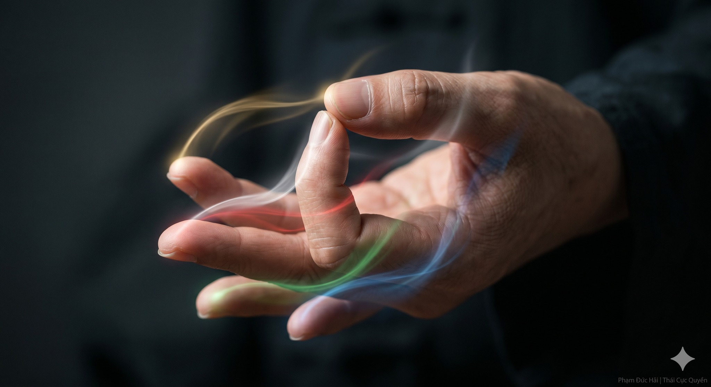

# BÍ MẬT 'CHỈ CÔNG':

> 📅 *Thứ Năm 28/05/2026 09:15* · 📸 1 ảnh

[← Quay lại danh sách bài viết](../index.md)

---

ĐỘNG NGÓN TAY, CHUYỂN NGŨ TẠNG
---
Ngón tay tuy nhỏ
nhưng là nơi bắt đầu
của các đường kinh mạch
nối thẳng về tim gan
nuôi dưỡng toàn thân

**ĐỘNG CHỈ CỬ CAN**
---
Trong Dưỡng Sinh Công
phép "Chỉ Công" dạy rằng:
Ngón tay vừa động
gân mạch liền thông
Khơi mở Can khí
giúp gân cốt dẻo dai
vận động không rào cản

NGŨ HÀNH TRÊN ĐẦU NGÓN TAY

Mỗi ngón tay đại diện
cho một nguồn năng lượng:
- Ngón cái: Tỳ (Thổ)
- Ngón trỏ: Phế (Kim)
- Ngón giữa: Tâm (Hỏa)
- Ngón áp út: Can (Mộc)
- Ngón út: Thận (Thủy)
Luyện Chỉ chính là
điều hòa ngũ hành bên trong

KHAI GÂN HOẠT LẠC

Không cần dùng lực mạnh
chỉ cần ý dẫn động
từ kẽ móng tay
đến bả vai, cột sống
Sóng khí chạy dọc thân
làm ấm từng tế bào
giải phóng mọi ứ trệ

LUYỆN TẬP MỌI LÚC

Chỉ cần mười lăm phút
ngồi ngay tại bàn làm việc
xoay nhẹ các khớp tay
kết hợp hơi thở sâu
Bạn sẽ thấy tinh thần
trở nên sáng suốt lạ thường

CHO NÊN

Đừng coi thường việc nhỏ.
Ngón tay thông thì Thân an.
Chỉ Công là chìa khóa
mở ra sức mạnh nội tạng.

Phạm Đức Hải | Thái Cực Quyền