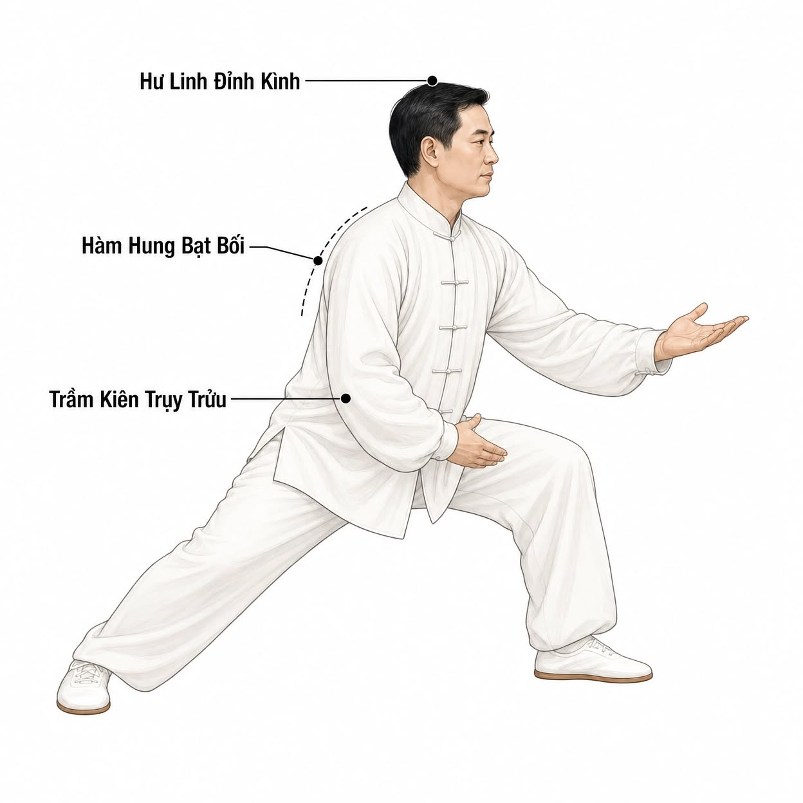

# CHUYỂN TRỌNG TÂM VÀ BỘ PHÁP (FOOTWORK)

> 📅 *May 27, 2026 7:24:54 am* · 📸 1 ảnh · 🎬 0 video

[← Quay lại danh sách bài viết](../index.md)

---

Trong Thái Cực Quyền, di chuyển không đơn thuần là đi từ điểm A đến điểm B, mà là quá trình quản lý trọng lực. Sai lầm lớn nhất của người mới là di chuyển bằng cách "đẩy" cơ thể đi, dẫn đến việc bị mất thăng bằng hoặc gây áp lực lớn lên khớp gối. Mục tiêu của tháng thứ hai là làm chủ nguyên lý "Hư - Thực".

Hiểu sâu về nguyên lý "Hư" và "Thực" trong di chuyển.

"Thực" là chân chịu lực (trọng tâm đặt lên), "Hư" là chân không chịu lực (trọng tâm không đặt lên). Trong mọi bước đi của Thái Cực Quyền, phải có sự phân định rõ ràng giữa Hư và Thực.

Sai lầm phổ biến: "Hai chân cùng thực" (Double Weight) – tức là trọng tâm nằm chính giữa hai chân. Khi ở trạng thái này, bạn sẽ trở nên cứng nhắc, khó thay đổi hướng đột ngột và dễ bị mất thăng bằng nếu có lực tác động.

Trạng thái lý tưởng: Trọng tâm luôn di chuyển mượt mà từ chân này sang chân kia. Khi chân trái bắt đầu bước đi, nó phải là "Hư" (nhẹ nhàng), trong khi chân phải là "Thực" (vững chãi).

Nguyên nhân là do họ cố gắng nhớ bằng trí não (Memory) thay vì nhớ bằng cơ bắp (Muscle Memory).

Giải pháp:

Tập trung vào "Điểm chuyển": Thay vì nhớ cả động tác, hãy chỉ nhớ điểm kết thúc của thức này là điểm bắt đầu của thức kia.

Tập chậm cực độ: Hãy thử tập một thức trong vòng 1 phút. Khi di chuyển cực chậm, não bộ có thời gian để ghi nhận mọi thay đổi nhỏ nhất của cơ thể, từ đó hình thành trí nhớ cơ bắp sâu sắc hơn.

Bạn đã hoàn thành giai đoạn "hình thành khung" khi:

1. Có thể thực hiện 5-7 thức cơ bản mà không cần nhìn tài liệu.
2. Di chuyển không còn bị nghiêng ngả, không còn hiện tượng "hai chân cùng thực".
3. Hơi thở tự động đồng bộ với động tác mà không cần quá cố gắng.
4. Bắt đầu cảm thấy sự "mềm mại" trong các khớp xương và sự nhẹ nhõm trong tâm trí sau mỗi buổi tập.

* * *CHUYỂN TRỌNG TÂM VÀ BỘ PHÁP (FOOTWORK)Trong Thái Cực Quyền, di chuyển không đơn thuần là đi từ điểm A đến điểm B, mà là quá trình quản lý trọng lực. Sai lầm lớn nhất của người mới là di chuyển bằng cách "đẩy" cơ thể đi, dẫn đến việc bị mất thăng bằng hoặc gây áp lực lớn lên khớp gối. Mục tiêu của tháng thứ hai là làm chủ nguyên lý "Hư - Thực".Hiểu sâu về nguyên lý "Hư" và "Thực" trong di chuyển."Thực" là chân chịu lực (trọng tâm đặt lên), "Hư" là chân không chịu lực (trọng tâm không đặt lên). Trong mọi bước đi của Thái Cực Quyền, phải có sự phân định rõ ràng giữa Hư và Thực.Sai lầm phổ biến: "Hai chân cùng thực" (Double Weight) – tức là trọng tâm nằm chính giữa hai chân. Khi ở trạng thái này, bạn sẽ trở nên cứng nhắc, khó thay đổi hướng đột ngột và dễ bị mất thăng bằng nếu có lực tác động.Trạng thái lý tưởng: Trọng tâm luôn di chuyển mượt mà từ chân này sang chân kia. Khi chân trái bắt đầu bước đi, nó phải là "Hư" (nhẹ nhàng), trong khi chân phải là "Thực" (vững chãi).Nguyên nhân là do họ cố gắng nhớ bằng trí não (Memory) thay vì nhớ bằng cơ bắp (Muscle Memory).Giải pháp:Tập trung vào "Điểm chuyển": Thay vì nhớ cả động tác, hãy chỉ nhớ điểm kết thúc của thức này là điểm bắt đầu của thức kia.Tập chậm cực độ: Hãy thử tập một thức trong vòng 1 phút. Khi di chuyển cực chậm, não bộ có thời gian để ghi nhận mọi thay đổi nhỏ nhất của cơ thể, từ đó hình thành trí nhớ cơ bắp sâu sắc hơn.Bạn đã hoàn thành giai đoạn "hình thành khung" khi:1. Có thể thực hiện 5-7 thức cơ bản mà không cần nhìn tài liệu.2. Di chuyển không còn bị nghiêng ngả, không còn hiện tượng "hai chân cùng thực".3. Hơi thở tự động đồng bộ với động tác mà không cần quá cố gắng.4. Bắt đầu cảm thấy sự "mềm mại" trong các khớp xương và sự nhẹ nhõm trong tâm trí sau mỗi buổi tập.* * *