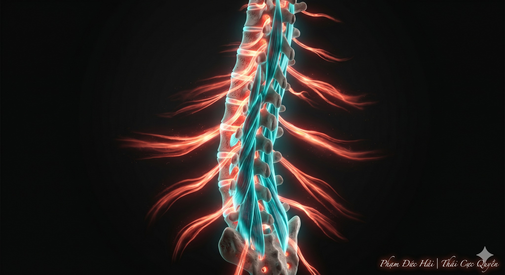

# CƠ SÂU: MÁY BƠM KHÍ HUYẾT CỦA CƠ THỂ

> 📅 *May 28, 2026 9:17:21 am* · 📸 1 ảnh · 🎬 0 video

[← Quay lại danh sách bài viết](../index.md)

---

Ngoại gia luyện cơ to
Nội gia luyện cơ nhỏ
Cơ to để biểu diễn
Cơ nhỏ để dưỡng sinh
Đây chính là bí mật
của nội công thâm hậu

THÂM TẦNG CÂN NHỤC

Cơ sâu là những dải cơ
nằm sát tận xương
bao quanh cột sống
ôm lấy tạng phủ
Nội Kinh gọi đó là
"Cân chi tiểu giả"
những thớ gân nhỏ nhiệm

MÁY BƠM CỦA ĐAN ĐIỀN

Khi cơ sâu vận động
nó tác động trực tiếp
lên hệ thống mạch máu
sát tận trong tủy xương
Đóng vai trò như máy bơm
đẩy khí huyết lưu thông
đến tận cùng ngõ ngách

CƠ NHỎ ĐỘNG, BÁCH HÀI TÙY

Chỉ cần một cử động nhỏ
từ bên trong lõi thân
toàn bộ hệ thống xương khớp
sẽ tự động xoay chuyển
Không dùng lực cơ bắp
mà dùng lực của gân
vận hành rất nhẹ nhàng

PHỤC HỒI TỪ BÊN TRONG

Luyện được cơ sâu
là luyện được sự đàn hồi
của hệ thống kinh cân
Giúp giải tỏa chèn ép
nuôi dưỡng cột sống
làm ấm nóng Đan điền
tái tạo nguồn nhựa sống

CHO NÊN

Luyện ngoài không bằng dưỡng trong.
Cơ to dễ mỏi, cơ nhỏ bền bỉ.
Vận động được cơ sâu
mới chạm tới chân lý dưỡng sinh.

Phạm Đức Hải | Thái Cực QuyềnCƠ SÂU: MÁY BƠM KHÍ HUYẾT CỦA CƠ THỂNgoại gia luyện cơ toNội gia luyện cơ nhỏCơ to để biểu diễnCơ nhỏ để dưỡng sinhĐây chính là bí mậtcủa nội công thâm hậuTHÂM TẦNG CÂN NHỤCCơ sâu là những dải cơnằm sát tận xươngbao quanh cột sốngôm lấy tạng phủNội Kinh gọi đó là"Cân chi tiểu giả"những thớ gân nhỏ nhiệmMÁY BƠM CỦA ĐAN ĐIỀNKhi cơ sâu vận độngnó tác động trực tiếplên hệ thống mạch máusát tận trong tủy xươngĐóng vai trò như máy bơmđẩy khí huyết lưu thôngđến tận cùng ngõ ngáchCƠ NHỎ ĐỘNG, BÁCH HÀI TÙYChỉ cần một cử động nhỏtừ bên trong lõi thântoàn bộ hệ thống xương khớpsẽ tự động xoay chuyểnKhông dùng lực cơ bắpmà dùng lực của gânvận hành rất nhẹ nhàngPHỤC HỒI TỪ BÊN TRONGLuyện được cơ sâulà luyện được sự đàn hồicủa hệ thống kinh cânGiúp giải tỏa chèn épnuôi dưỡng cột sốnglàm ấm nóng Đan điềntái tạo nguồn nhựa sốngCHO NÊNLuyện ngoài không bằng dưỡng trong.Cơ to dễ mỏi, cơ nhỏ bền bỉ.Vận động được cơ sâumới chạm tới chân lý dưỡng sinh.Phạm Đức Hải | Thái Cực Quyền