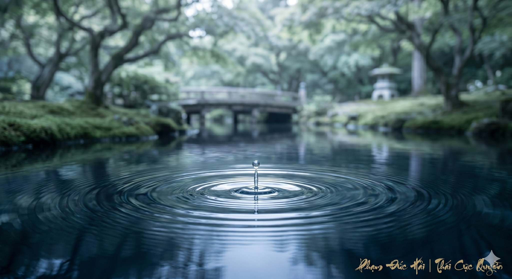

# ĐIỀU HÒA HƠI THỞ KHI CĂNG THẲNG

> 📅 *May 28, 2026 7:55:29 am* · 📸 1 ảnh · 🎬 0 video

[← Quay lại danh sách bài viết](../index.md)

---

Khi áp lực bủa vây
hơi thở thường nông
dồn lên vùng ngực
làm tâm trí rối
làm thân thể mệt

HƠI THỞ LÀ CẦU NỐI
Trong Thái Cực Quyền
hơi thở nối liền
giữa Thân và Tâm
Khi stress ập đến
Âm Dương mất cân bằng
Khí bốc lên đầu
gây ra nóng nảy

CHỈNH LẠI HỆ TRỤC
Trước khi thở sâu
hãy chỉnh lại trục
Treo đỉnh đầu lên
thả lỏng vai xuống
Khi đường ống thẳng
Khí mới có lối
để đi xuống sâu

PHÉP THỞ QUY TỨC
Đừng cố ép hơi
Hãy hít vào chậm
đưa Khí xuống bụng
Cảm nhận Đan điền
phình nhẹ tự nhiên
Thở ra thật dài
như buông gánh nặng

VẬN HÀNH TỰ NHIÊN
Thở không dùng lực
Thở bằng sự thả lỏng
Khi hơi thở sâu
hệ thần kinh tĩnh
áp lực tan biến
thân tâm hợp nhất

CHO NÊN
Stress là do Khí loạn.
Thở sâu là để Khí quy.
Trục thẳng thì Tâm an.

Phạm Đức Hải | Thái Cực QuyềnĐIỀU HÒA HƠI THỞ KHI CĂNG THẲNGKhi áp lực bủa vâyhơi thở thường nôngdồn lên vùng ngựclàm tâm trí rốilàm thân thể mệtHƠI THỞ LÀ CẦU NỐITrong Thái Cực Quyềnhơi thở nối liềngiữa Thân và TâmKhi stress ập đếnÂm Dương mất cân bằngKhí bốc lên đầugây ra nóng nảyCHỈNH LẠI HỆ TRỤCTrước khi thở sâuhãy chỉnh lại trụcTreo đỉnh đầu lênthả lỏng vai xuốngKhi đường ống thẳngKhí mới có lốiđể đi xuống sâuPHÉP THỞ QUY TỨCĐừng cố ép hơiHãy hít vào chậmđưa Khí xuống bụngCảm nhận Đan điềnphình nhẹ tự nhiênThở ra thật dàinhư buông gánh nặngVẬN HÀNH TỰ NHIÊNThở không dùng lựcThở bằng sự thả lỏngKhi hơi thở sâuhệ thần kinh tĩnháp lực tan biếnthân tâm hợp nhấtCHO NÊNStress là do Khí loạn.Thở sâu là để Khí quy.Trục thẳng thì Tâm an.Phạm Đức Hải | Thái Cực Quyền