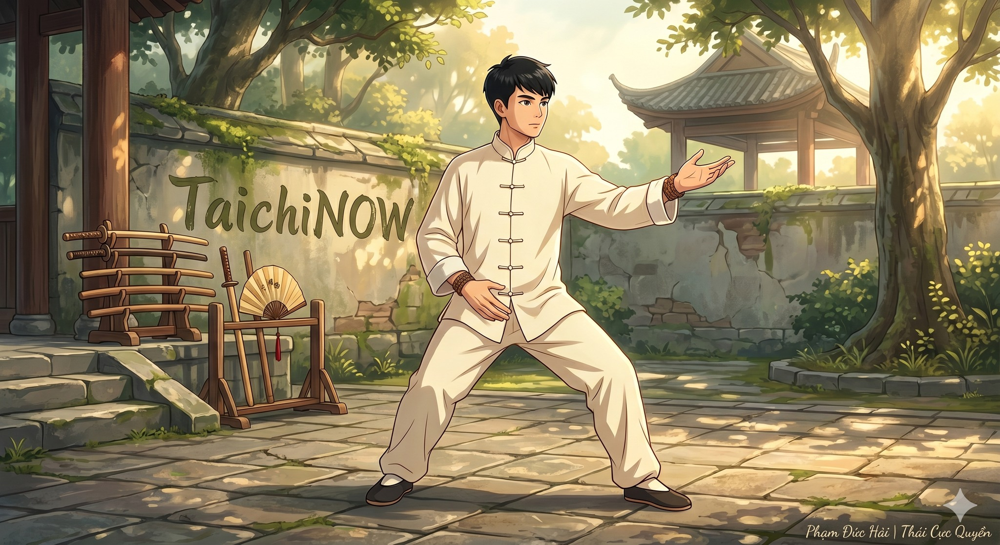

# ĐẠI ĐẠO CHÍ GIẢN: BÍ MẬT THÁI CỰC QUYỀN LUẬN

> 📅 *Thứ Tư 27/05/2026 06:59* · 📸 1 ảnh

[← Quay lại danh sách bài viết](../index.md)

---

"Thái cực quyền luận" – Vương Tông Nhạc
Tựa như ngọn hải đăng
Soi đường cho người học võ
Vượt qua muôn trùng sóng gió
Về với bản nguyên.

---

ÂM DƯƠNG TƯƠNG TẾ

Mọi sự ở đời
Đều khởi từ cái không
Từ cái vô hình
Động thì phân chia
Tĩnh thì hợp lại
Thái cực sinh ra
Như máy động tĩnh
Là mẹ Âm Dương
Cứng mềm hỗ trợ
Cùng tồn tại, cùng phát triển
Ấy mới là Kình.

---

ĐỘNG TRONG TĨNH LẶNG

Muốn vươn đi xa
Phải giữ gốc vững
Muốn vạn sự hanh thông
Tâm phải tịnh
Cơ thể phải thả lỏng
"Hàm hung bạt bối"
"Trầm kiên trụy khuỷu"
Hơi thở nhẹ nhàng
Như tơ như nhện
"Khí trầm Đan điền"
Năng lượng tích tụ
Sức mạnh nội tại
Dần dần nảy sinh.

---

VẬN HÀNH TỰ NHIÊN

Đừng tìm bên ngoài
Đừng cầu hoa mỹ
Hãy quay về bên trong
Lắng nghe cơ thể
Hợp nhất thân tâm
"Ý dẫn Khí, Khí dẫn Lực"
Tròn trịa đầy đặn
Không điểm lồi lõm
Không nơi đứt đoạn
Bỏ đi sức mỏng
Đón lấy sức dày
Thuận theo tự nhiên
Sẽ thấy thong dong.

---

CHO NÊN 

Đừng chỉ nhìn vào "Quyền"
Hãy cảm nhận "Lý"
Võ thuật không chỉ là đòn đánh
Mà là con đường tu thân
Vượt qua cái hời hợt bên ngoài
Chạm đến bản chất bên trong
Sống một đời Thái cực
Cân bằng, hòa hợp, an nhiên.

Phạm Đức Hải | Thái Cực Quyền