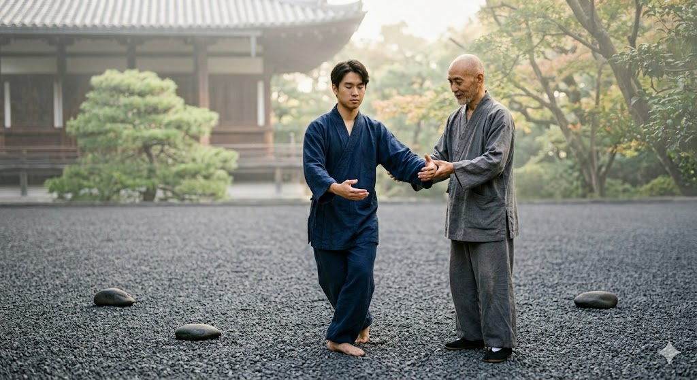

# Góc Nhìn Từ Thái Cực Quyền: Thế Nào Là "Sự Thấu Hiểu Đích Thực"?

> 📅 *Jun 02, 2026 11:19:45 am* · 📸 1 ảnh · 🎬 0 video

[← Quay lại danh sách bài viết](../index.md)

---

Bây giờ, hãy cùng bước lên thảm tập Thái Cực Quyền.

Hãy tưởng tượng một người đã ghi nhớ thuộc lòng từng bài quyền, từng tư thế và mọi chuỗi chuyển động của Dương Gia quyền. Họ có thể nói cho bạn chính xác góc đặt của bàn chân và tên gọi của tất cả 108 thức. Về mặt cơ học, việc tích lũy dữ liệu của họ là hoàn hảo không tì vết.

Nhưng ngay khoảnh khắc họ tham gia tập Thôi Thủ với bạn đồng môn, cơ thể họ lập tức cứng đờ. Họ dùng lực để kháng cự lại lực, mất đi trục gốc và bị đẩy ngã mất thăng bằng. Tại sao? Bởi vì họ chỉ mới tích lũy cái kiến thức về Thái Cực Quyền, chứ họ chưa hề có sự thấu hiểu đích thực về nó.

Sự thấu hiểu đích thực - hay còn gọi là tri kiến chân thật hoặc trí tuệ sâu sắc - hoàn toàn khác biệt với việc lưu trữ dữ liệu:
Nó được chuyển hóa vào thân tâm, chứ không chỉ ghi nhớ: Sự thấu hiểu đích thực là khi kiến thức rơi từ trên đầu xuống vùng trung tâm của bạn (vùng Đan Điền). Nó không còn là thứ bạn phải chủ động suy nghĩ xem phải làm thế nào nữa; nó đã trở thành một phần con người bạn và cách bạn vận hành trong thế giới này.

Nó mang tính chuyển động và linh hoạt: Trong Thái Cực Quyền, bạn không chống lại một lực đang lao đến; bạn hấp thụ, chuyển hướng và hóa giải nó. Sự thấu hiểu đích thực mang lại cho bạn sự linh hoạt về mặt tinh thần để làm điều tương tự trong cuộc sống hàng ngày. Khi cuộc sống ném vào bạn một biến số căng thẳng, bạn không gãy vụn; bạn uyển chuyển nương theo và vượt qua nó.

Nó kết nối cái vi mô với cái vĩ mô: Một kỹ sư nhìn vào từng bánh răng riêng lẻ; một người tập Thái Cực Quyền cảm nhận lực hợp nhất của toàn bộ cơ thể. Tri kiến chân thật cho phép bạn thấy các điểm dữ liệu nhỏ kết nối với nhau như thế nào để tạo nên bức tranh lớn hơn về cuộc đời, các mối quan hệ và sức khỏe của bạn.

Kiến thức là việc đọc một cuốn sổ tay hướng dẫn cách cân bằng trọng lượng cơ thể. Sự thấu hiểu đích thực là cảm nhận mặt đất dưới chân, hạ thấp trọng tâm cấu trúc và trải nghiệm trạng thái cân bằng hoàn hảo.

3. Bản Thiết Kế Đột Phá: Lộ Trình Chuyển Dịch Từ Tích Lũy Sang Thấu Hiểu

Làm thế nào để chúng ta bắc cầu nối hai thế giới này? Chúng ta không cần phải vứt bỏ tư duy kỹ thuật của mình—chúng ta chỉ cần nâng cấp hệ điều hành (upgrade the operating system) của nó. Dưới đây là một bản thiết kế (blueprint) thân thiện giúp bạn chuyển mình từ một người thu thập dữ liệu thành một hành giả thông thái.

[ Kiến Thức Tích Trữ / Dữ Liệu Thô ]
│
▼ (Màng Lọc Thái Cực Quyền)
• Hạ thấp tần suất hấp thụ (Slow Down Consumption)
• Tháo dỡ & Tái cấu trúc tư duy (Deconstruct)
• Kiểm chứng trong môi trường thực tế (Real-world Test)
│
▼
[ Sự Thấu Hiểu Đích Thực ]
Hạ Thấp "Tần Suất Lấy Mẫu" (Slow Down Your "Sampling Rate")
Trong xử lý tín hiệu số (digital signal processing), việc tăng tần suất lấy mẫu (sampling rate) sẽ thu được nhiều dữ liệu hơn, nhưng nó cũng có thể tạo ra một lượng lớn nhiễu tần số cao (high-frequency noise). Tâm trí của bạn cũng vậy. Hãy ngừng cố gắng tiêu thụ tất cả mọi thứ.

Thay vì đọc ba cuốn sách một cách hời hợt, hãy chọn một cuốn sách sâu sắc và đọc nó với sự hiện diện trọn vẹn. Hãy đối xử với nó như một bài quyền chậm rãi. Đọc một đoạn văn, dừng lại, hít thở và để các khái niệm lắng dịu vào tâm trí trước khi tiến về phía trước.

Tháo Dỡ Và Tái Cấu Trúc Niềm Tin: 
Hãy sử dụng kỹ năng kỹ thuật của bạn để tự chẩn đoán nội tại. Khi bạn tiếp cận một thông tin mới hoặc một niềm tin đã cũ, đừng vội chấp nhận nó. Hãy tháo rời nó ra:

Các thành phần cốt lõi của ý tưởng này là gì?
Nó sẽ thất bại ở đâu khi bị thử nghiệm áp lực?
Nó ăn khớp như thế nào với những trải nghiệm thực tế của chính tôi?

Bằng cách chủ động tháo dỡ những gì mình biết, bạn biến dữ liệu thụ động thành những hiểu biết mang tính cấu trúc và thực tế.
Kiểm Chứng Trong Môi Trường Thực Tế: Thái Cực Quyền dạy chúng ta rằng lý thuyết phải được kiểm chứng bằng thực tại. Nếu định hình cấu trúc cơ thể của bạn sai, bạn sẽ mất thăng bằng ngay lập tức. Hãy áp dụng điều này vào mọi lĩnh vực bạn học.

Nuôi Dưỡng Trạng Thái "Buông Lỏng" 

Một trong những khái niệm quan trọng nhất trong Thái Cực Quyền là "Phóng Tùng" - thường được dịch là thư giãn, nhưng bản chất của nó là sự chủ động giải phóng những căng thẳng không cần thiết trong khi vẫn duy trì được tính toàn vẹn của cấu trúc.

Hãy áp dụng trạng thái "Tùng" này vào không gian tinh thần của bạn. Hãy buông bỏ mong muốn lo âu phải biết mọi thứ, phải trả lời mọi email ngay lập tức hoặc phải chạy theo mọi xu hướng công nghệ. Hãy tin tưởng rằng nền tảng cấu trúc của bạn đã đủ vững chãi. 

Bằng cách thả lỏng tâm trí đang bận rộn, bạn sẽ dọn sạch băng thông nhận thức cần thiết để những tri kiến sâu sắc, tự nhiên được hiển lộ.

Lời Kết: Thắp Lên Ngọn Lửa, Đừng Chỉ Đổ Đầy Bình XăngGóc Nhìn Từ Thái Cực Quyền: Thế Nào Là "Sự Thấu Hiểu Đích Thực"?Bây giờ, hãy cùng bước lên thảm tập Thái Cực Quyền.Hãy tưởng tượng một người đã ghi nhớ thuộc lòng từng bài quyền, từng tư thế và mọi chuỗi chuyển động của Dương Gia quyền. Họ có thể nói cho bạn chính xác góc đặt của bàn chân và tên gọi của tất cả 108 thức. Về mặt cơ học, việc tích lũy dữ liệu của họ là hoàn hảo không tì vết.Nhưng ngay khoảnh khắc họ tham gia tập Thôi Thủ với bạn đồng môn, cơ thể họ lập tức cứng đờ. Họ dùng lực để kháng cự lại lực, mất đi trục gốc và bị đẩy ngã mất thăng bằng. Tại sao? Bởi vì họ chỉ mới tích lũy cái kiến thức về Thái Cực Quyền, chứ họ chưa hề có sự thấu hiểu đích thực về nó.Sự thấu hiểu đích thực - hay còn gọi là tri kiến chân thật hoặc trí tuệ sâu sắc - hoàn toàn khác biệt với việc lưu trữ dữ liệu:Nó được chuyển hóa vào thân tâm, chứ không chỉ ghi nhớ: Sự thấu hiểu đích thực là khi kiến thức rơi từ trên đầu xuống vùng trung tâm của bạn (vùng Đan Điền). Nó không còn là thứ bạn phải chủ động suy nghĩ xem phải làm thế nào nữa; nó đã trở thành một phần con người bạn và cách bạn vận hành trong thế giới này.Nó mang tính chuyển động và linh hoạt: Trong Thái Cực Quyền, bạn không chống lại một lực đang lao đến; bạn hấp thụ, chuyển hướng và hóa giải nó. Sự thấu hiểu đích thực mang lại cho bạn sự linh hoạt về mặt tinh thần để làm điều tương tự trong cuộc sống hàng ngày. Khi cuộc sống ném vào bạn một biến số căng thẳng, bạn không gãy vụn; bạn uyển chuyển nương theo và vượt qua nó.Nó kết nối cái vi mô với cái vĩ mô: Một kỹ sư nhìn vào từng bánh răng riêng lẻ; một người tập Thái Cực Quyền cảm nhận lực hợp nhất của toàn bộ cơ thể. Tri kiến chân thật cho phép bạn thấy các điểm dữ liệu nhỏ kết nối với nhau như thế nào để tạo nên bức tranh lớn hơn về cuộc đời, các mối quan hệ và sức khỏe của bạn.Kiến thức là việc đọc một cuốn sổ tay hướng dẫn cách cân bằng trọng lượng cơ thể. Sự thấu hiểu đích thực là cảm nhận mặt đất dưới chân, hạ thấp trọng tâm cấu trúc và trải nghiệm trạng thái cân bằng hoàn hảo.3. Bản Thiết Kế Đột Phá: Lộ Trình Chuyển Dịch Từ Tích Lũy Sang Thấu HiểuLàm thế nào để chúng ta bắc cầu nối hai thế giới này? Chúng ta không cần phải vứt bỏ tư duy kỹ thuật của mình—chúng ta chỉ cần nâng cấp hệ điều hành (upgrade the operating system) của nó. Dưới đây là một bản thiết kế (blueprint) thân thiện giúp bạn chuyển mình từ một người thu thập dữ liệu thành một hành giả thông thái.[ Kiến Thức Tích Trữ / Dữ Liệu Thô ]│▼ (Màng Lọc Thái Cực Quyền)• Hạ thấp tần suất hấp thụ (Slow Down Consumption)• Tháo dỡ & Tái cấu trúc tư duy (Deconstruct)• Kiểm chứng trong môi trường thực tế (Real-world Test)│▼[ Sự Thấu Hiểu Đích Thực ]Hạ Thấp "Tần Suất Lấy Mẫu" (Slow Down Your "Sampling Rate")Trong xử lý tín hiệu số (digital signal processing), việc tăng tần suất lấy mẫu (sampling rate) sẽ thu được nhiều dữ liệu hơn, nhưng nó cũng có thể tạo ra một lượng lớn nhiễu tần số cao (high-frequency noise). Tâm trí của bạn cũng vậy. Hãy ngừng cố gắng tiêu thụ tất cả mọi thứ.Thay vì đọc ba cuốn sách một cách hời hợt, hãy chọn một cuốn sách sâu sắc và đọc nó với sự hiện diện trọn vẹn. Hãy đối xử với nó như một bài quyền chậm rãi. Đọc một đoạn văn, dừng lại, hít thở và để các khái niệm lắng dịu vào tâm trí trước khi tiến về phía trước.Tháo Dỡ Và Tái Cấu Trúc Niềm Tin:Hãy sử dụng kỹ năng kỹ thuật của bạn để tự chẩn đoán nội tại. Khi bạn tiếp cận một thông tin mới hoặc một niềm tin đã cũ, đừng vội chấp nhận nó. Hãy tháo rời nó ra:Các thành phần cốt lõi của ý tưởng này là gì?Nó sẽ thất bại ở đâu khi bị thử nghiệm áp lực?Nó ăn khớp như thế nào với những trải nghiệm thực tế của chính tôi?Bằng cách chủ động tháo dỡ những gì mình biết, bạn biến dữ liệu thụ động thành những hiểu biết mang tính cấu trúc và thực tế.Kiểm Chứng Trong Môi Trường Thực Tế: Thái Cực Quyền dạy chúng ta rằng lý thuyết phải được kiểm chứng bằng thực tại. Nếu định hình cấu trúc cơ thể của bạn sai, bạn sẽ mất thăng bằng ngay lập tức. Hãy áp dụng điều này vào mọi lĩnh vực bạn học.Nuôi Dưỡng Trạng Thái "Buông Lỏng"Một trong những khái niệm quan trọng nhất trong Thái Cực Quyền là "Phóng Tùng" - thường được dịch là thư giãn, nhưng bản chất của nó là sự chủ động giải phóng những căng thẳng không cần thiết trong khi vẫn duy trì được tính toàn vẹn của cấu trúc.Hãy áp dụng trạng thái "Tùng" này vào không gian tinh thần của bạn. Hãy buông bỏ mong muốn lo âu phải biết mọi thứ, phải trả lời mọi email ngay lập tức hoặc phải chạy theo mọi xu hướng công nghệ. Hãy tin tưởng rằng nền tảng cấu trúc của bạn đã đủ vững chãi.Bằng cách thả lỏng tâm trí đang bận rộn, bạn sẽ dọn sạch băng thông nhận thức cần thiết để những tri kiến sâu sắc, tự nhiên được hiển lộ.Lời Kết: Thắp Lên Ngọn Lửa, Đừng Chỉ Đổ Đầy Bình Xăng