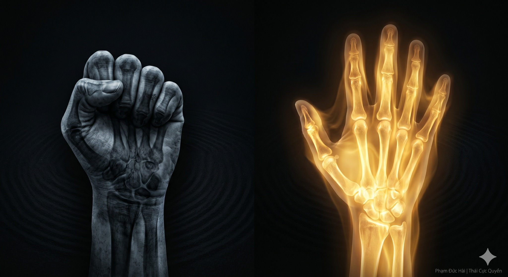

# GỒNG CƠ VÀ NỘI LỰC: SỰ KHÁC BIỆT

> 📅 *Thứ Năm 28/05/2026 08:30* · 📸 1 ảnh

[← Quay lại danh sách bài viết](../index.md)

---

Nhiều người lầm tưởng
khỏe là phải gồng
là bắp thịt cuồn cuộn
Nhưng trong Thái Cực
gồng chính là rào cản
ngăn trở sức mạnh thật sự

GỒNG CƠ LÀ CẢN TRỞ

Khi bạn gồng cơ
bắp thịt sẽ bó cứng
làm bít lấp đường thông
của khí và huyết
Thân thể bị tách rời
chỗ thừa, chỗ thiếu
dẫn đến mau kiệt sức

NỘI LỰC LÀ DÒNG CHẢY

Nội lực không đến từ thịt
nội lực đến từ xương
đến từ hệ gân sâu
sát tận trong tủy
Lực này là chỉnh thể
từ bàn chân qua trục
truyền thẳng ra tay
vận hành không đứt đoạn

THẢ LỎNG ĐỂ TỤ LỰC

Thái Cực Quyền Luận dạy
Buông lỏng để thông
Càng lỏng thì lực càng sâu
Càng tĩnh thì lực càng mạnh
Khi cơ bắp không gồng
thì "tiểu cơ nhục" mới động
nội lực mới phát lộ

Ý DẪN KHÍ HÀNH

Đừng dùng sức bắp tay
Hãy dùng ý điều khiển
Dẫn khí chạy trong xương
Mượn lực từ mặt đất
Khi hệ trục đã vững
mọi chuyển động nhẹ nhàng
nhưng mang sức ngàn cân

CHO NÊN

Gồng là biểu hiện của yếu.
Thả lỏng là gốc của mạnh.
Bỏ đi cái cứng nhắc
để tìm thấy sức mạnh thực sự.

Phạm Đức Hải | Thái Cực Quyền