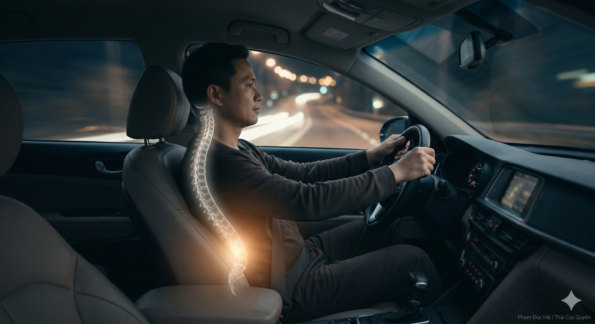

# HÓA GIẢI CĂNG THẮNG THẮT LƯNG KHI LÁI XE

> 📅 *Thứ Năm 28/05/2026 08:20* · 📸 1 ảnh

[← Quay lại danh sách bài viết](../index.md)

---

Lái xe đường dài
thân hình bất động
thắt lưng chịu áp
như một điểm gãy
của dòng sinh khí

CỬU TỌA THƯƠNG NHỤC
Hoàng Đế Nội Kinh dạy
Ngồi lâu hại thịt
Thắt lưng là nhà
của tạng Thận
Nếu bị chèn ép
Dương khí không thông
người sẽ mỏi mệt

VĨ LƯ TRUNG CHÍNH
Dù đang cầm lái
hãy giữ Hệ trục
Xương cùng hướng xuống
như treo quả tạ
để mở vùng thắt lưng
giải tỏa áp lực
lên từng đốt sống

DẪN KHÍ VỀ GỐC
Thả lỏng đôi vai
Hơi thở nhẹ nhàng
chìm xuống Đan điền
Làm ấm Mệnh môn
giúp Thận khí vững
thắt lưng từ đó
tự động lỏng ra

VẬN HÀNH KHÔNG TẢI
Đừng gồng thắt lưng
để chống lại xe
Hãy nương theo trục
Thả lỏng cơ sâu
Để dòng khí huyết
luân chuyển không ngừng
trên suốt dặm trường

CHO NÊN
Đau lưng không phải tại xe.
Mà tại Hệ trục bị gãy.
Mở thắt lưng để thông Khí.
Lái xe trong sự thả lỏng.

Phạm Đức Hải | Thái Cực Quyền