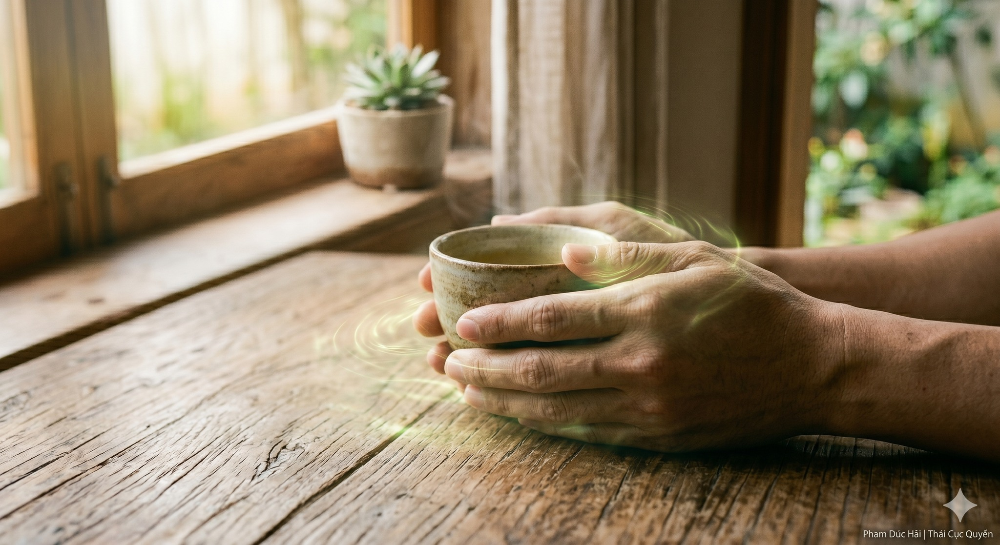

# KỸ THUẬT 'TÙNG':

> 📅 *May 28, 2026 9:27:01 am* · 📸 1 ảnh · 🎬 0 video

[← Quay lại danh sách bài viết](../index.md)

---

THẢ LỎNG TRONG SINH HOẠT

Thái Cực không chỉ
nằm trên sân tập
Thái Cực nằm trong
cách bạn cầm điện thoại
cách bạn chạm chuột
mỗi phút mỗi giây

TÙNG KHÔNG PHẢI BUÔNG XUÔI

Nhiều người lầm tưởng
thả lỏng là rũ rượi
Nhưng "Tùng" thật sự
là xương giữ thẳng
gân thịt buông mềm
Trục vẫn trung chính
nhưng không gồng cứng

THẢ LỎNG KHI LÀM VIỆC

Khi bạn cầm chuột
hãy thả lỏng cổ tay
Đừng gồng ngón tay
như đang bóp nghẹt
Dùng ý dẫn động
nhẹ nhàng như nước
Khí sẽ không tắc
ở khớp vai, khuỷu

TÙNG TRONG TỪNG BƯỚC ĐI

Khi đi trên phố
đừng gồng bắp chân
Hãy để bàn chân
chạm đất mềm mại
như bàn chân mèo
Lực từ mặt đất
truyền thẳng lên trục
thân nhẹ tênh tênh

GIỮ LẤY NĂNG LƯỢNG

Càng gồng càng hao
Càng tùng càng tụ
Khi cơ thể lỏng
cửa ngõ khí mở
Năng lượng trời đất
tự động đi vào
nuôi dưỡng tạng phủ

CHO NÊN

Đời là bài tập lớn.
Thả lỏng là đỉnh cao.
Tùng được trong sinh hoạt
là đắc đạo dưỡng sinh.

Phạm Đức Hải | Thái Cực QuyềnKỸ THUẬT 'TÙNG':THẢ LỎNG TRONG SINH HOẠTThái Cực không chỉnằm trên sân tậpThái Cực nằm trongcách bạn cầm điện thoạicách bạn chạm chuộtmỗi phút mỗi giâyTÙNG KHÔNG PHẢI BUÔNG XUÔINhiều người lầm tưởngthả lỏng là rũ rượiNhưng "Tùng" thật sựlà xương giữ thẳnggân thịt buông mềmTrục vẫn trung chínhnhưng không gồng cứngTHẢ LỎNG KHI LÀM VIỆCKhi bạn cầm chuộthãy thả lỏng cổ tayĐừng gồng ngón taynhư đang bóp nghẹtDùng ý dẫn độngnhẹ nhàng như nướcKhí sẽ không tắcở khớp vai, khuỷuTÙNG TRONG TỪNG BƯỚC ĐIKhi đi trên phốđừng gồng bắp chânHãy để bàn chânchạm đất mềm mạinhư bàn chân mèoLực từ mặt đấttruyền thẳng lên trụcthân nhẹ tênh tênhGIỮ LẤY NĂNG LƯỢNGCàng gồng càng haoCàng tùng càng tụKhi cơ thể lỏngcửa ngõ khí mởNăng lượng trời đấttự động đi vàonuôi dưỡng tạng phủCHO NÊNĐời là bài tập lớn.Thả lỏng là đỉnh cao.Tùng được trong sinh hoạtlà đắc đạo dưỡng sinh.Phạm Đức Hải | Thái Cực Quyền