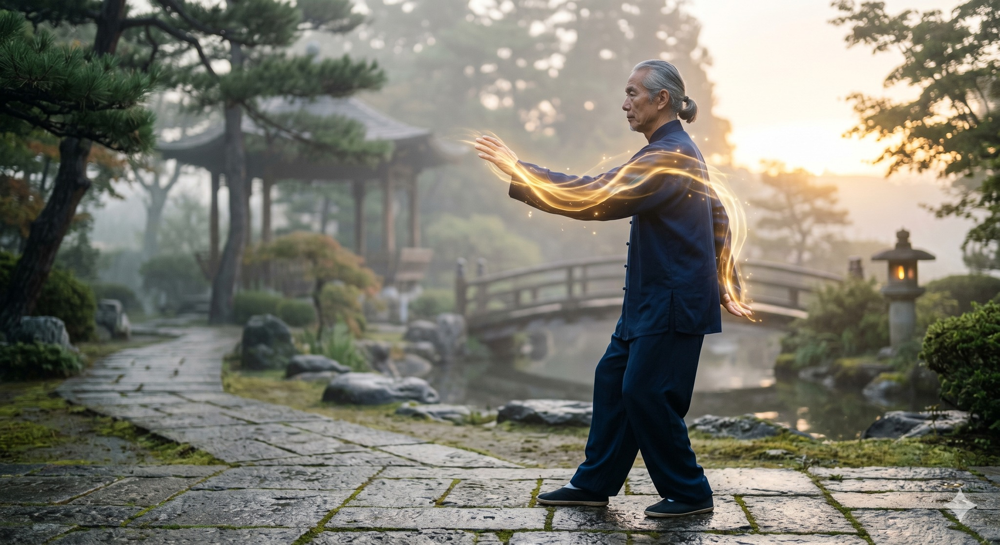

# LỢI ÍCH CỦA VIỆC THẢ LỎNG KHỚP VAI

> 📅 *May 27, 2026 4:55:50 pm* · 📸 1 ảnh · 🎬 0 video

[← Quay lại danh sách bài viết](../index.md)

---

Nhiều người thường
mang vác áp lực
lên chính đôi vai
khiến vai co rút
cứng nhắc như đá
làm bít lấp
dòng chảy sinh mệnh

VAI LÀ CỬA NGÕ

Trong cơ thể
khớp vai là cửa
nối thân và tay
nối đất và trời
Nếu vai bị gồng
khí sẽ bị kẹt
huyết không hành
đầu óc mệt mỏi

TRẦM KIÊN TRỤY KHUỶU

Thái Cực Quyền Luận dạy
Hạ vai xuống
Thả lỏng khuỷu tay
Đó không phải
là sự buông xuôi
mà là sự mở ra
để khí đi thông

CHO NÊN

Vai có lỏng
thì thân mới nhẹ.
Tâm có an
thì Khí mới thông.

Phạm Đức Hải | Thái Cực QuyềnLỢI ÍCH CỦA VIỆC THẢ LỎNG KHỚP VAINhiều người thườngmang vác áp lựclên chính đôi vaikhiến vai co rútcứng nhắc như đálàm bít lấpdòng chảy sinh mệnhVAI LÀ CỬA NGÕTrong cơ thểkhớp vai là cửanối thân và taynối đất và trờiNếu vai bị gồngkhí sẽ bị kẹthuyết không hànhđầu óc mệt mỏiTRẦM KIÊN TRỤY KHUỶUThái Cực Quyền Luận dạyHạ vai xuốngThả lỏng khuỷu tayĐó không phảilà sự buông xuôimà là sự mở rađể khí đi thôngCHO NÊNVai có lỏngthì thân mới nhẹ.Tâm có anthì Khí mới thông.Phạm Đức Hải | Thái Cực Quyền