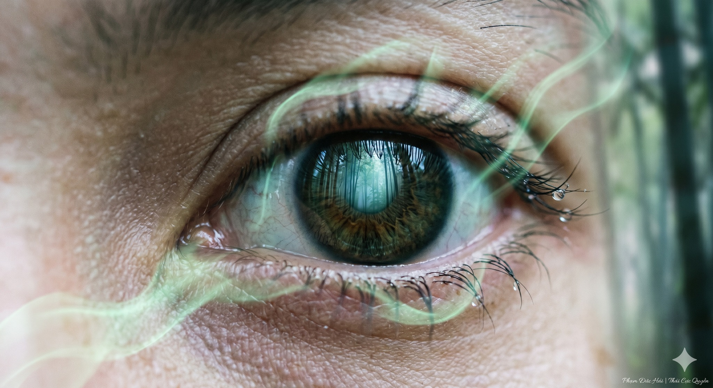

# MẮT LÀ CỬA SỔ CỦA CAN KHÍ

> 📅 *Thứ Năm 28/05/2026 08:22* · 📸 1 ảnh

[← Quay lại danh sách bài viết](../index.md)

---

Nhiều người mỏi mắt
thường chỉ dùng thuốc
hoặc đeo kính cận
Nhưng trong Nội Kinh
mắt không chỉ để nhìn
mắt là cửa ngõ
của tạng Can   

CAN KHAI KHIẾU RA MẮT

Nội Kinh có dạy
Can khai khiếu ra mắt 
Tinh hoa của Gan
đều tụ về đôi mắt
Nếu Can khí hư
mắt sẽ mờ khô 
nhức mỏi triền miên
giảm sự sáng suốt  

MẮT DÙNG QUÁ HAO KHÍ

Người hiện đại ngày nay
nhìn màn hình quá nhiều 
khiến mắt phải làm việc
vượt ngưỡng tự nhiên
Mắt dùng càng nhiều
Can huyết càng hao 
Tâm càng dễ loạn  

NGỦ ĐỂ HUYẾT VỀ GAN

Cổ nhân có câu
Khi ngủ huyết về Can 
Mắt được nghỉ ngơi
Gan mới được dưỡng
Nếu thức quá khuya
Dương khí không tàng
Can không tàng huyết 
Mắt sẽ vô thần  

GIỮ TRỤC ĐỂ DƯỠNG MẮT

Trong Thái Cực Quyền
Tầm mắt phải bình ổn
Hệ trục phải thẳng
Treo đỉnh đầu lên cao 
Để Khí từ Đan điền
theo đường ống thẳng
nuôi dưỡng đôi mắt
Thần thái tinh anh  

CHO NÊN

Dưỡng mắt là dưỡng Gan.
Bớt nhìn ra bên ngoài.
Để giữ Khí ở bên trong.
Mắt sáng thì Tâm an.   

Phạm Đức Hải | Thái Cực Quyền