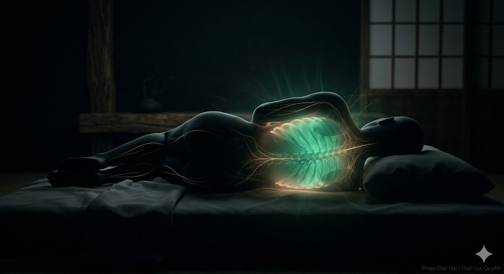

# NGỦ TRƯỚC 23 GIỜ: BÍ MẬT TÁI TẠO HUYẾT

> 📅 *Thứ Năm 28/05/2026 10:13* · 📸 1 ảnh

[← Quay lại danh sách bài viết](../index.md)

---

Thức đêm hại thân
Ai cũng biết rõ
Nhưng vì sao muộn?
Nội Kinh vạch lối
Chỉ rõ thiên cơ.

CAN ĐỞM CHỦ THỜI

Từ 23 giờ đêm
đến 3 giờ sáng
Khí huyết vận hành
vào kinh Đởm, kinh Can
Đây là thời gian
Vương quốc của Gan
lên ngôi làm việc.

CAN TÀNG HUYẾT

Hoàng Đế Nội Kinh dạy:
"Nằm thì huyết về Gan"
Khi thân thể bất động
tâm trí chìm sâu
Dòng máu mới tụ hội
về lại tạng Can
để thanh lọc, giải độc.

THỨC ĐÊM HAO HUYẾT

Sau 23 giờ đêm
nếu bạn còn thức
mắt còn nhìn màn hình
Can khí sẽ uất kết
Huyết phải đem đi nuôi
cho mắt, cho não
Gan bị đói máu
mất đi nguồn sinh.

GÂN KHÔ, TRỤC SỤP

"Can chủ về gân"
Huyết không về Gan
Gân sẽ không nhuận
Sáng dậy người cứng nhắc
Hệ trục lung lay
Mắt khô, người mệt
Dù ngủ bù ban ngày.

CHO NÊN

Thuận thiên dã thọ
Nghịch thiên dã vong
Tắt đèn trước 23 giờ
để dòng huyết hồi sinh
Dưỡng Gan là dưỡng mạng.

Phạm Đức Hải | Thái Cực Quyền