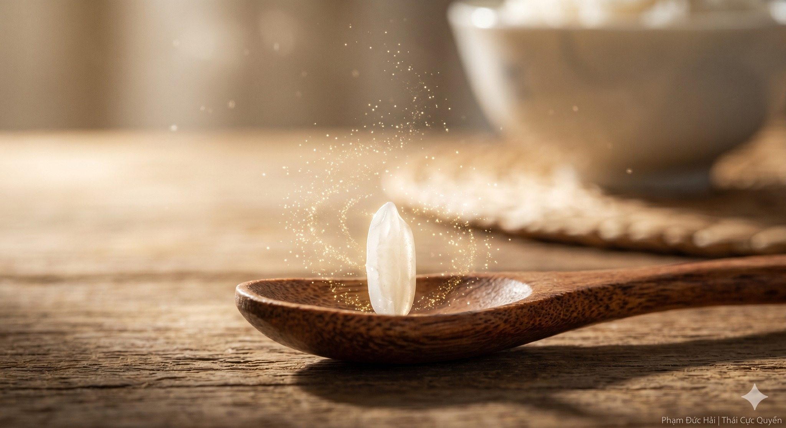

# NHAI KỸ LÀ DƯỠNG TỲ VỊ

> 📅 *May 28, 2026 8:38:44 am* · 📸 1 ảnh · 🎬 0 video

[← Quay lại danh sách bài viết](../index.md)

---

Ăn uống không chỉ
là nạp năng lượng
mà là một quá trình
vận hóa tinh vi
của đất trời và thân thể

BƯỚC ĐẦU CỦA VẬN HÓA

Tỳ vị là gốc
của hậu thiên sinh mệnh
Nhưng Tỳ vị không có răng
Răng nằm ở miệng
Nhai kỹ chính là
giảm tải cho gốc
giúp Khí được thông suốt

TÂN DỊCH LÀ TRÂN QUÝ

Khi nhai đủ lâu
nước miếng tuôn ra
Đông y gọi là Tân dịch
là dòng suối quý
giúp chuyển hóa thức ăn
thành nguồn huyết sạch
nuôi dưỡng hệ trục thân

CON SỐ BA MƯƠI

Hãy nhai ba mươi lần
cho mỗi miếng ăn
Đừng ăn trong vội vã
làm loạn nhịp Âm Dương
Khi nhai thật kỹ
vị ngọt tự nhiên
sẽ thấm vào Đan điền

THẲNG TRỤC KHI ĂN

Giữ lưng thật thẳng
Thả lỏng đôi vai
Để đường ống tiêu hóa
không bị gập ghềnh
Khí huyết lưu thông
Tỳ vị ấm nóng
vận hành rất tự nhiên

CHO NÊN

Ăn nhanh là hại Tỳ.
Nhai kỹ là dưỡng Thân.
Gốc khỏe thì người mới an.

Phạm Đức Hải | Thái Cực QuyềnNHAI KỸ LÀ DƯỠNG TỲ VỊĂn uống không chỉlà nạp năng lượngmà là một quá trìnhvận hóa tinh vicủa đất trời và thân thểBƯỚC ĐẦU CỦA VẬN HÓATỳ vị là gốccủa hậu thiên sinh mệnhNhưng Tỳ vị không có răngRăng nằm ở miệngNhai kỹ chính làgiảm tải cho gốcgiúp Khí được thông suốtTÂN DỊCH LÀ TRÂN QUÝKhi nhai đủ lâunước miếng tuôn raĐông y gọi là Tân dịchlà dòng suối quýgiúp chuyển hóa thức ănthành nguồn huyết sạchnuôi dưỡng hệ trục thânCON SỐ BA MƯƠIHãy nhai ba mươi lầncho mỗi miếng ănĐừng ăn trong vội vãlàm loạn nhịp Âm DươngKhi nhai thật kỹvị ngọt tự nhiênsẽ thấm vào Đan điềnTHẲNG TRỤC KHI ĂNGiữ lưng thật thẳngThả lỏng đôi vaiĐể đường ống tiêu hóakhông bị gập ghềnhKhí huyết lưu thôngTỳ vị ấm nóngvận hành rất tự nhiênCHO NÊNĂn nhanh là hại Tỳ.Nhai kỹ là dưỡng Thân.Gốc khỏe thì người mới an.Phạm Đức Hải | Thái Cực Quyền