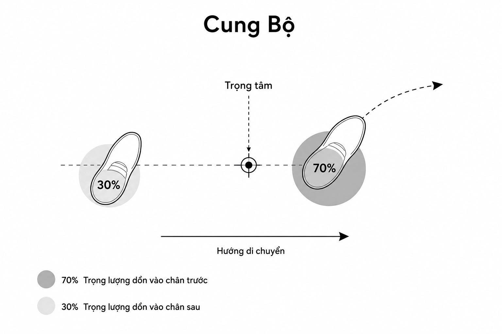
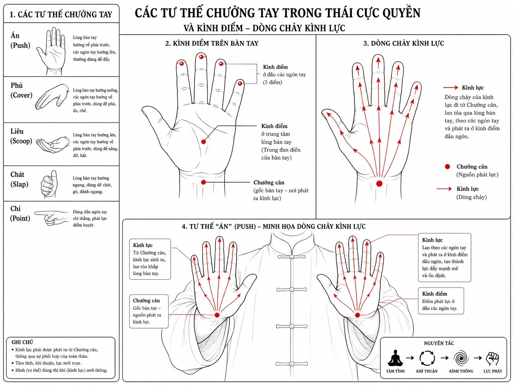

# PhotosPhotosHƯỚNG DẪN KỸ THUẬT THÁI CỰC QUYỀNLời Giới ThiệuThái Cực Quyền, một trong những môn võ thuật nội phát nổi tiếng của Trung Quốc, có nguồn gốc từ Đạo gia và được truyền tụng do Tổ sư Trươn...

> 📅 *Jun 01, 2026 6:51:01 am* · 📸 3 ảnh · 🎬 0 video

[← Quay lại danh sách bài viết](../index.md)

---

PhotosPhotosHƯỚNG DẪN KỸ THUẬT THÁI CỰC QUYỀNLời Giới ThiệuThái Cực Quyền, một trong những môn võ thuật nội phát nổi tiếng của Trung Quốc, có nguồn gốc từ Đạo gia và được truyền tụng do Tổ sư Trương Tam Phong sáng lập tại núi Võ Đang. Môn võ này không chỉ là một hệ thống các kỹ thuật tự vệ mà còn là phương pháp rèn luyện sức khỏe, tinh thần, và đạt đến sự hài hòa giữa nội và ngoại. Tài liệu này cung cấp một hướng dẫn toàn diện về Thái Cực Quyền, bao gồm lịch sử phát triển, các yếu lĩnh luyện tập, đồ giải quyền thức, và kỹ thuật Thôi Thủ, nhằm giúp người học hiểu sâu sắc và thực hành hiệu quả môn võ này.Chương 1: Lịch Sử Phát Triển Môn Thái Cực Quyền (Thế kỷ 18 - 20)1.1. Nguồn Gốc và Sự Khác Biệt Giữa Các Phái VõTrung Quốc là cái nôi của nhiều ngành võ thuật, được chia thành hai nguồn chính: Ngoại Nhập (tiêu biểu là Thiếu Lâm) và Nội Phát (tiêu biểu là Thái Cực Quyền). Trong khi Thiếu Lâm chú trọng các động tác mạnh mẽ, kịch liệt, Thái Cực Quyền của Đạo gia lại tập trung vào sự mềm dẻo, uyển chuyển và rèn luyện khí lực. Môn Võ Đang, với ba bài quyền chính yếu là Hình Ý Quyền, Bát Quái Quyền, và Thái Cực Quyền, được thiết kế để huấn luyện môn sinh từ thấp lên cao, mỗi bài mang một sắc thái riêng biệt. Bát Quái Quyền thường được dùng để đối kháng trong môn phái, còn Thái Cực Quyền chủ yếu dùng để luyện Khí lực, mặc dù cũng có thể dùng để đấu. Sự khác biệt trong công dụng này thường dẫn đến những tranh cãi về bài quyền nào cao hơn, nhưng thực chất, mỗi bài đều có giá trị riêng và bổ trợ cho nhau.1.2. Dòng Họ Dương và Sự Phát Triển Của Thái Cực QuyềnDương Phúc Khôi, tự Lộ Thiền (1799-1872), người Vĩnh Niên, Hà Bắc, Trung Quốc, là một nhân vật quan trọng trong lịch sử Thái Cực Quyền. Ông học võ Thái Cực Quyền từ Trần gia (Trần Trường Hưng truyền) và sau đó trở thành võ sư nổi tiếng với biệt danh “Tiêm Miên quyền” hay Nhuyễn quyền. Để thích ứng với nhu cầu của đại chúng, Dương Lộ Thiền đã dần sửa đổi các hình thức và nội dung quyền thế cổ quyền, làm cho chúng dễ luyện tập hơn. Con cháu ông, đặc biệt là Dương Trừng Phủ (1833-1936), tiếp tục phát triển và truyền bá rộng rãi môn Thái Cực Quyền của dòng họ Dương.Sự khác biệt giữa Thái Cực Quyền Trần thức và Dương thức:Đặc điểm   - Tốc độ  - Động tác  -  Hô hấpTrần Thức - Nhanh chậm không đều - Xoay trôn ốc, vận kình mạnh như xoay đinh ốc, triển nhiễu chiết triết - Phương pháp “đơn điền nội chuyển” kết hợp với khí trầm đơn điềnDương Thức - Đều đặn như kéo tơ, không ngừng - Đơn giản, gọn gàng, vận kình xoay tròn như kéo tơ - Chú trọng hô hấp và động tác kết hợp tự nhiên: “khí trầm Đan điền”Dương Trừng Phủ đã tạo ra một giá thức Thái Cực Quyền gọn gàng, dễ tập, kết cấu vững vàng, thân pháp trung chính, động tác ôn hòa, cương nhu nội hàm, linh động nhẹ nhàng. Nó phù hợp với mọi lứa tuổi, sức khỏe, và giới tính, đồng thời có lợi cho việc chữa bệnh, giữ gìn sức khỏe và tăng cường sức mạnh. Kỹ thuật của Dương gia đề cao tư thế Khinh, Trầm tự nhiên, Trung chính viên mãn, Hùng hậu trang trọng, và Bình chính phốc thực, giúp biểu lộ khí phách lớn một cách tự nhiên và vẻ đẹp hình thể con người.Chương 2: Thái Cực Quyền Yếu Lĩnh (Bàn về sự luyện tập Thái Cực Quyền)2.1. Thập Yếu của Thái Cực QuyềnThái Cực Quyền có mười yếu lĩnh quan trọng mà người học cần nắm vững để đạt được hiệu quả cao nhất trong luyện tập:1. Hư Linh Đỉnh Kình: Đầu phải ngay thẳng, tinh thần tập trung, không gồng cứng cổ. Điều này giúp khí huyết lưu thông, tinh thần minh mẫn.2. Hàm Hung Bạt Bối: Ngực hơi hóp vào, lưng hơi ưỡn ra. Giúp khí trầm xuống đan điền, tăng cường sức mạnh và sự ổn định.3. Trầm Kiên Trụy Trửu: Vai buông lỏng, khuỷu tay chùng xuống. Tránh gồng vai, giúp khí lực truyền xuống cánh tay một cách tự nhiên.Hình 2.1: Minh họa các yếu lĩnh Hư Linh Đỉnh Kình, Hàm Hung Bạt Bối, Trầm Kiên Trụy Trửu trong Thái Cực Quyền.4. Vĩ Lư Trung Chính: Xương cụt thẳng hàng, giữ cho cột sống thẳng. Đảm bảo sự cân bằng và ổn định của toàn thân.5. Khí Trầm Đan Điền: Khí lực tập trung vào vùng đan điền (bụng dưới). Giúp tăng cường nội lực và sự vững chãi.6. Ý Dụng Bất Dụng Lực: Dùng ý dẫn dắt động tác, không dùng sức thô bạo. Điều này tạo ra sự mềm mại, liên tục và sức mạnh tiềm ẩn.7. Thượng Hạ Tương Tùy: Các bộ phận trên và dưới cơ thể phải phối hợp nhịp nhàng. Tay động, eo động, chân động, mắt thần cũng động theo, tạo thành một chỉnh thể thống nhất.8. Nội Ngoại Tương Hợp: Tinh thần và động tác phải hòa hợp. Tâm ý khai hợp cùng với tay chân, tạo thànhsự thống nhất giữa nội và ngoại.9. Tương Liên Bất Đoạn: Các động tác phải liên tục, không ngừng nghỉ, như dòng nước chảy, kéo tơ. Điều này tạo ra sự liền mạch và sức mạnh tiềm ẩn.10. Động Trung Cần Tỉnh: Trong động có tĩnh, trong tĩnh có động. Dù đang di chuyển nhưng tinh thần vẫn phải tĩnh tại, chậm rãi, giúp hô hấp sâu và dài lâu.2.2. Bảng Liệt Kê Các Điểm Kình và Căn Nguyên Của KìnhTrong luyện tập Thái Cực Quyền, việc hiểu rõ các điểm kình (lực) và cách vận chuyển chúng là vô cùng quan trọng. Kình lực không phải là sức mạnh cơ bắp thô thiển mà là sự vận động của ý và khí, được dẫn dắt từ chân, qua đùi, eo, và biểu hiện ra đầu ngón tay.Hình 2.2: Minh họa các tư thế chưởng tay và điểm kình trong Thái Cực Quyền, thể hiện dòng chảy kình lực.Số tt. hình / Kình điểm tay phảiKình điểm tay tráiBộ phận chủ yếuỞ bên xích cốt chỗ gần cổ tayỞ bên ngón tay út chỗ chưởng cănỞ tay phảiDi chuyển tới chỗ đầu nạo cốtDi chuyển tới đầu nạo cốtDi chuyểnDi chuyển tới bên ngón tay út chỗ chưởng cănDi chuyển tới bên nạo cốt chỗ gần cổ tayỞ tay tráiKhi chưởng xoa lên, kình ở khoảng giữa của ngón trỏ và ngón cái.Khi cùi chỏ hạ trầm xuống thì kình ở chỗ chưởng căn xích cốt với ngón út.Tay phảiDi chuyển tới bên nạo cốt.Di chuyển tới chưởng căn.Ở tay phảiDi chuyển tới bên nạo cốt gần cổ tay.Chỗ chưởng cănỞ tay phảiDi chuyển tới bên ngón út chổ cổ tayDi chuyển tới bên hổ khẩu, giữa trỏ và cáiỞ tay phảiDi chuyển tới gần bên xích cốt chỗ cổ tayDi chuyển tới bên nạo cốt chỗ gần cổ tayỞ tay phảiDi chuyển tới bên ngón út chỗ chưởng cănDi chuyển tới giữa lòng bàn tay (giữa ngón trỏ và út)Ở tay phảiDi chuyển tới bên ngoài cánh tay dướiDi chuyển tới bên ngón tay út chỗ chưởng căn.Ở 2 tayDi chuyển tới gần cổ tay, chỗ bên ngoài cánh tay dưới.Di chuyển tới chưởng căn (gốc bàn tay)Ở 2 tayDi chuyển tới ngón tay út.Di chuyển tới ngón tay út.Ở 2 tayDi chuyển tới bên ngón tay út chỗ chưởng căn.Di chuyển tới ngón út chỗ chưởng cănỞ 2 tayDi chuyển tới chưởng căn.Di chuyển tới chưởng căn.Ở 2 tayCăn Nguyên Của Kình: Câu nói “Kỳ căn tại cước, phát ư thối, chủ tể ư yêu, hình ư thủ chỉ” (kình gốc tại bàn chân, phát tại đùi vế, chủ tể ở eo lưng, hình thức thì do nơi tay và ngón tay) tóm tắt nguyên lý vận kình. Kình lực bắt nguồn từ chân, được phát ra từ đùi, điều khiển bởi eo và biểu hiện qua tay, ngón tay. Sự chuyển động phải “tiết tiết quán xuyến, hoàn chỉnh nhất khí” (liên tục, hoàn chỉnh trong một hơi), đảm bảo “nhất động vô hữu bất động, nhất tỉnh vô hữu bất tỉnh” (một động tác không có gì là không động, một tĩnh không có gì là không tĩnh).2.3. Nhãn Thần trong Thái Cực QuyềnNhãn thần (ánh mắt) được coi là “tâm chi miêu” (cửa sổ của tâm hồn), phản ánh hoạt động của tư tưởng. Trong Thái Cực Quyền, nhãn thần là một bộ phận quan trọng, phải kết hợp với động tác và ý niệm. Khi luyện tập, mắt phải nhìn tới phương hướng mà tay sắp diễn tới, thể hiện nguyên tắc “dĩ nhãn lĩnh thủ” (dùng mắt dẫn dắt tay) và “tiên tại tâm, hậu tại thân” (ý đến trước, thân theo sau). Điều này giúp duy trì sự tập trung, định hướng và sự thống nhất giữa nội và ngoại.Chương 3: Thái Cực Quyền Đồ Giải (Danh xưng quyền thức)Phần này trình bày danh sách các quyền thức trong Thái Cực Quyền, được đồ giải bằng 244 hình ảnh, trong đó có 76 hình chính bản của Thầy Dương Trừng Phủ và phần còn lại do họa sĩ Châu Nguyên Long bổ sung. Các động tác di chuyển dựa trên lộ đồ Đông-Nam-Tây-Bắc và được giảng giải chi tiết theo đồ hình.Quy tắc đọc đồ giải:• Mũi tên: Chỉ hướng di chuyển của động tác kế tiếp.• Mũi tên liền: Tay và chân phải.• Mũi tên chấm chấm: Tay và chân trái.• Mũi tên thấu thị: Gần to, xa nhỏ, thể hiện độ sâu và khoảng cách.• Chân bước: Rất quan trọng, được vẽ rõ để dễ luyện tập và phân biệt:• Bóng đầy đủ: Hai bàn chân đứng trên mặt đất.• Không bóng: Hoàn toàn lìa đất (nhảy lên không trung).• Bóng ở gót: Chỉ có gót chạm đất.• Bóng ở mũi: Chỉ có mũi bàn chân chạm đất.3.1. Danh Sách Các Quyền Thức1. Thức dự bị2. Khởi thức3. Lãm tước vĩ4. Đơn tiên5. Đề thủ thượng thế6. Bạch hạc lượng xí7. Tả lâu tất ảo bộ8. Thủ huy tỳ bà9. Tả hữu lâu tất ảo bộ10. Thủ huy tỳ bà11. Tả lâu tất ảo bộ12. Tấn bộ ban lan trùy13. Như phong tự bế14. Thập tự thủ15. Bảo hổ qui sơn16. Trửu để khán trùy17. Tả hữu đảo niệm hầu18. Tà phi thức19. Đề thủ thượng thế20. Bạch hạc lượng xí21. Tả lâu tất ảo bộ22. Hải để châm23. Phiến thông hối24. Phiết thân trùy25. Tấn bộ ban lan trùy26. Thượng bộ lãm tước vĩ27. Đơn tiên28. Vân thủ29. Đơn tiên30. Cao thám mã31. Tả hữu phân cước32. Chuyển thân đăng cước33. Tả hữu lâu tất ảo bộ34. Tấn bộ tài trùy35. Phiên thân phiết thân trùy36. Tấn bộ ban lan trùy37. Hữu đặng cước38. Tả đả hổ thức39.Hữu đả hổ thức40. Hồi thân hữu đặng cước41. Song phong quán nhĩ42. Tả đặng cước43. Chuyển thân hữu đặng cước44. Tấn bộ ban lan trùy45. Như phong tự bế46. Thập tự thủ47. Bảo hổ qui sơn48. Tà đơn tiên49. Dã mã phân tung50. Lãm tước vĩ51. Đơn tiên52. Ngọc nữ xuyên thoa53. Lãm tước vĩ54. Đơn tiên55. Vân thủ56. Đơn tiên57. Hạ thế58. Kim kê độc lập59. Tả hữu đảo niệm hầu60. Tà phi thức61. Đề thủ thượng thế62. Bạch hạc lượng xí63. Tả lâu tất ảo bộ64. Hải để châm65. Phiến thông hối66. Chuyển thân bạch xà thổ tín67. Ban lan trùy68. Lãm tước vĩ69. Đơn tiên70. Vân thủ71. Đơn tiên72. Cao thám mã đới xuyên chưởng73. Thập tự thối74. Tấn bộ chỉ tề trùy75. Thượng bộ lãm tước vĩ76. Đơn tiên77. Hạ thế78. Thượng bộ thất tinh79. Thoái bộ khóa hổ80. Chuyển thân bài liên81. Loan cung xạ hổ82. Tấn bộ ban lan trùy83. Như phong tự bế84. Thập tự thủ85. Thâu thế3.2. Mô Tả Chi Tiết Một Số Quyền Thức Tiêu Biểu3.2.1. Thức Dự Bị• Động tác: Đứng thẳng người, hai chân song song, rộng bằng vai. Hai tay buông xuôi, mắt nhìn thẳng hướng Nam. Hơi thở chậm, sâu, điều hòa.• Yếu lý: Thân, thủ, tâm, bộ pháp phải theo đúng 10 điều quan yếu. Tinh thần ngưng lại, bỏ mọi suy nghĩ, tập trung để “tụ THẦN” cho các thức kế tiếp.3.2.2. Khởi Thức• Động tác 1: Hai tay từ từ cất lên, thẳng tay, ngang vai, song song, lòng bàn tay úp xuống, ngón tay khép gần nhau, hổ khẩu tròn.• Động tác 2: Hai tay hạ chưởng xuống song song phía trước hai vế, mũi bàn tay cất lên cho chưởng tâm chiếu song song với mặt đất.• Yếu lý: “Tiên tại tâm, hậu tại thân” – ý dẫn động tác. Vai trầm, chỏ cong, đầu xương chỏ hướng xuống đất (trụy trửu). Toàn thân nới lỏng tự nhiên, bàn tay nhẹ nhàng như có vật nặng tưởng tượng. Mọi động tác liên tục, không ngừng nghỉ, như kéo tơ. “Tự đình phi đình” – hình như ngừng mà không phải ngừng.3.2.3. Lãm Tước Vĩ (Bằng, Phúc, Tề, Án)Đây là một thức phức tạp bao gồm bốn tiểu thức: Bằng (đỡ), Phúc (lăn), Tề (xô), Án (đẩy).A. Tả Hữu Bằng Thức:• Động tác 1: Chân phải mở ra hướng Tây-Nam 45 độ, thân xoay theo. Trọng lượng chuyển sang chân phải, gối phải co, chân trái co lên đưa về trước mũi bàn chân phải. Chưởng trái xoay về hướng phải, chưởng phải xoay từ trên xuống. Hai chỏ trụy xuống, song chưởng như ôm quả banh. Mắt nhìn Tây-Nam.• Động tác 2: Chân phải đứng thẳng, chân trái đưa chậm sát mặt đất tới hướng Nam, trọng lượng chuyển dần sang trái bằng cách co gối trái. Thân trồi từ phải sang Nam thành tả cung thối. Chưởng trái xoa vòng xuống, chưởng phải xoa vòng lên cao ngang vai, chưởng ngửa. Mắt nhìn Tây-Nam.• Động tác 3: Chân phải co lên đưa về hướng Tây, sức nặng dồn lên chân trái, mũi bàn chân xoay qua Tây-Nam. Chưởng phải xoay vòng lên, chưởng tâm hướng vào ngực. Chưởng trái theo chỏ trầm co về sau xoay thành chưởng tâm chiếu tới chưởng phải, như ôm quả cầu. Cánh tay phải và trái bằng ngang. Mắt nhìn thẳng.B. Phúc Thức:• Động tác 1: Chân trái bước tới hướng Tây, gót chân chạm đất, mũi chân cất lên. Trọng lượng chuyển dần sang chân trái. Chưởng phải từ từ xoay về hướng Tây, chưởng tâm hướng xuống. Chưởng trái xoay về hướng Tây, chưởng tâm hướng lên. Hai chưởng như ôm quả cầu. Mắt nhìn Tây.• Động tác 2: Chân trái đứng thẳng, chân phải đưa chậm sát mặt đất tới hướng Tây, trọng lượng chuyển dần sang phải bằng cách co gối phải. Thân trồi từ trái sang Tây thành hữu cung thối. Chưởng phải xoa vòng xuống, chưởng trái xoa vòng lên cao ngang vai, chưởng ngửa. Mắt nhìn Tây.C. Tề Thức:• Động tác 1: Thân xoay về hướng Tây, chân chuyển thành Cung thối phải. Sức nặng dồn sang chân trước. Song chưởng ngoại triền, chưởng tâm phải chiếu vào ngực, chưởng tâm trái hướng Tây. Chưởng phải đẩy tới hướng Tây bằng lưng bàn tay, chưởng trái phụ lực. Hai chỏ trầm, bàn tay phải ngang mắt, cánh tay phải ngang ngực. Mắt nhìn thẳng hướng Tây.• Yếu lý: Thân trên đứng thẳng tự nhiên, vai trầm, chỏ trầm thấp hơn cổ tay. Chưởng trái đặt nhẹ nhàng gần bên trong cánh tay phải. Toàn thân điều hợp tự nhiên, không gồng cứng. Mắt thần nhìn chưởng trái.D. Án Thức:• Động tác 1: Chuyển trọng tâm thân thể ra chân sau bằng cách co gối chân trái. Cánh tay phải hơi nội triền, chưởng tâm phải hướng xuống. Chưởng trái đưa qua phía trên chưởng phải, hai chưởng chéo nhau. Gạt song chưởng sang hai bên, khoảng cách nhỏ hơn vai. Co chỏ, hồi thân về phía sau. Khi chưởng kéo về, hai chưởng hướng xuống rồi khép dần đối nhau.• Động tác 2: Chuyển trọng lực thân thể tới chân trước, biến thành Hữu cung bộ. Song chưởng đồng thời với chân chuyển, án (đẩy) tới. Chưởng tâm chiếu thẳng tới hướng Tây. Cổ tay ngang vai, chỏ trầm. Mắt nhìn thẳng hướng Tây, nhãn thần chú ý tới song chưởng đẩy tới.• Yếu lý: Khi chuyển trọng tâm về sau, khớp xương cổ cốt gần mông hơi trút về sau để thân thẳng. Song chưởng kéo về sau, hai chỏ trầm và khép lại. Khi đẩy tới trước, tay đi theo vòng cung lơi, không gắp, từ dưới lên. Tay và vai mềm dẻo tự nhiên. Chưởng phải hướng về trái, chưởng trái hướng về phải góc 45 độ. Vừa án vừa xoay ra trước, chưởng tâm song chưởng hạ trầm. Khi mới tập, phải đúng động tác và tư thế, sau đó vận kình “miên miên bất đoạn”, “vận kình như trừu ty” (kéo tơ).Chương 4: Thái Cực Thôi ThủThôi Thủ là một phần quan trọng của Thái Cực Quyền, giúp người luyện tập phát triển cảm giác, sự nhạy bén và khả năng ứng biến trong giao đấu. Nó bao gồm các kỹ thuật đẩy tay, tập trung vào việc cảm nhận lực của đối phương và hóa giải nó một cách mềm mại, sau đó phản công.4.1. Đinh Bộ Thôi Thủ• Mô tả: Đây là hình thức Thôi Thủ cơ bản, thực hiện ở tư thế đứng yên (đinh bộ). Hai người đứng đối diện, tay chạm tay, thực hiện các động tác đẩy, kéo, xoay tròn để cảm nhận và điều khiển lực của đối phương. Mục tiêu là duy trì sự cân bằng của bản thân và phá vỡ sự cân bằng của đối phương mà không dùng sức mạnh cơ bắp thô thiển.• Yếu lý: Tập trung vào sự “niêm, tùy, dính, liền” (dính chặt, theo sát, dính liền, không rời). Cảm nhận lực của đối phương, không đối kháng trực tiếp mà hóa giải bằng cách chuyển hướng lực. Sử dụng eo làm trục, các động tác phải mềm mại, liên tục và không có điểm chết.4.2. Hoạt Bộ Thôi Thủ• Mô tả: Là hình thức Thôi Thủ nâng cao, trong đó người luyện tập di chuyển bước chân (hoạt bộ) trong khi thực hiện các kỹ thuật đẩy tay. Điều này đòi hỏi sự phối hợp nhịp nhàng giữa thân pháp, bộ pháp và thủ pháp, tăng cường khả năng ứng biến và kiểm soát không gian.• Yếu lý: Ngoài các yếu lý của Đinh Bộ Thôi Thủ, Hoạt Bộ Thôi Thủ còn nhấn mạnh sự linh hoạt của bộ pháp. Bước chân phải nhẹ nhàng, uyển chuyển, di chuyển theo lực của đối phương để tạo lợi thế. Trọng tâm cơ thể luôn được duy trì ổn định trong mọi chuyển động.4.3. Đại Phúc• Mô tả: Đại Phúc là một kỹ thuật trong Thôi Thủ, thường được hiểu là một động tác lớn, bao quát, sử dụng toàn bộ cơ thể để hóa giải và phản công. Nó đòi hỏi sự phối hợp cao độ giữa ý, khí, lực và các bộ phận cơ thể để tạo ra một lực đẩy mạnh mẽ nhưng vẫn mềm mại.• Yếu lý: Tập trung vào việc sử dụng “khí trầm đan điền” và sự xoay chuyển của eo để tạo ra lực. Động tác phải liền mạch, không có sự gián đoạn, và lực được truyền từ chân lên, qua eo, ra tay một cách thống nhất. Mục tiêu là làm cho đối phương mất thăng bằng hoàn toàn và không thể chống đỡ.Chương 5: Phụ Lục5.1. Thái Cực Quyền LuậnThái Cực Quyền Luận là những bài viết, phân tích sâu sắc về triết lý và nguyên tắc của Thái Cực Quyền. Các bài luận này thường đi sâu vào các khái niệm như Âm Dương, Ngũ Hành, Bát Quái trong mối liên hệ với các động tác và yếu lý của quyền pháp. Chúng giúp người học không chỉ luyện tập các động tác mà còn hiểu được chiều sâu tư tưởng đằng sau môn võ này, từ đó nâng cao trình độ luyện tập và ứng dụng trong cuộc sống.Các bài luận thường đề cập đến:• Sự hòa hợp giữa Cương và Nhu: Thái Cực Quyền không chỉ mềm mại mà còn ẩn chứa sức mạnh cương mãnh, như câu “miên lý tàng kim” (trong bông gòn có sắt thép).• Nguyên tắc “Tứ Lạng Bạt Thiên Cân”: Dùng sức nhỏ hóa giải lực lớn, dựa trên nguyên lý đòn bẩy và sự chuyển hóa lực.• Tầm quan trọng của Ý và Khí: Ý dẫn khí, khí dẫn lực. Sức mạnh không đến từ cơ bắp mà từ sự điều hòa của ý và khí.Kết LuậnThái Cực Quyền là một môn võ thuật toàn diện, không chỉ rèn luyện thể chất mà còn tu dưỡng tinh thần. Từ lịch sử hình thành, các yếu lĩnh cơ bản, đến các quyền thức và kỹ thuật Thôi Thủ, mỗi khía cạnh đều chứa đựng những giá trị sâu sắc. Việc luyện tập Thái Cực Quyền đòi hỏi sự kiên trì, tập trung và hiểu biết sâu sắc về các nguyên tắc. Khi đạt đến trình độ cao, người luyện không chỉ có sức khỏe dẻo dai, tinh thần minh mẫn mà còn có khả năng tự vệ hiệu quả và đạt được sự hài hòa trong cuộc sống.Tải toàn bộ sách từ link này:https://drive.google.com/file/d/1bnFlDCx1DAffldL-HlkmNDuIOIDD1Gsj/view?usp=sharing