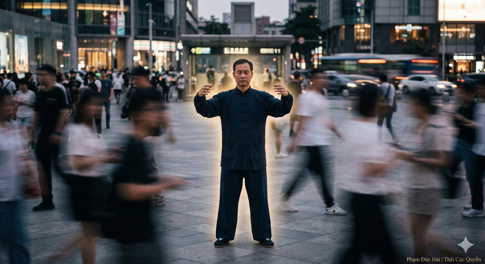

# SỨC MẠNH CỦA SỰ TĨNH LẶNG

> 📅 *Thứ Năm 28/05/2026 07:58* · 📸 1 ảnh

[← Quay lại danh sách bài viết](../index.md)

---

Thế giới ngoài kia
luôn ồn ào náo động
khiến tâm ta tán loạn
khiến khí ta tiêu hao
Nhưng sức mạnh thực sự
lại nằm ở sự tĩnh lặng

TRONG ĐỘNG CÓ TĨNH
Thái Cực Quyền Luận dạy
Cơ thể dù chuyển động
nhưng Tâm phải tĩnh
Như trục của bánh xe
xoay tròn không nghỉ
nhưng tâm trục bất động
đó là gốc của lực

TĨNH ĐỂ TỤ KHÍ
Khi thân ta tĩnh lại
Khí mới có chỗ về
Hệ trục mới ổn định
Dòng chảy sinh mệnh
không còn bị xao nhãng
tự động tụ về Đan điền
nuôi dưỡng nguồn chân khí

HÓA GIẢI MỌI BIẾN ĐỘNG
Trong võ thuật cũng vậy
lấy tĩnh chế động
lấy không đổi trị muôn đổi
Khi đối diện áp lực
nếu tâm ta tĩnh lặng
ta sẽ thấy rõ dòng chảy
biết đâu là hư thực
để vận hành tự nhiên

TĨNH KHÔNG PHẢI LÀ DỪNG
Tĩnh là sự tập trung cao độ
là sự thả lỏng tuyệt đối
trong một cấu trúc vững vàng
Tĩnh lặng giúp ta
nhìn thấu bản chất
của mọi sự việc đời thường

CHO NÊN
Tĩnh lặng là cội nguồn của nội lực.
Tâm không động thì Khí không tán.
Trong cái tĩnh, ta tìm thấy chính mình.

Phạm Đức Hải | Thái Cực Quyền