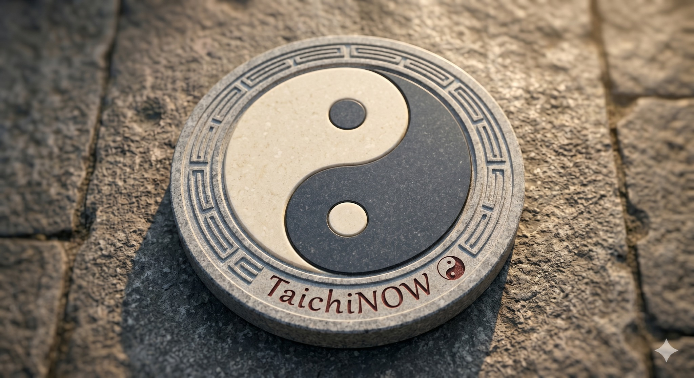

# THÁI CỰC QUYỀN LUẬN: BẢN NGUYÊN VÔ CỰC

> 📅 *May 27, 2026 6:55:25 am* · 📸 1 ảnh · 🎬 0 video

[← Quay lại danh sách bài viết](../index.md)

---

Thái cực sinh ra.
Từ trong vô cực.
Là máy động tĩnh.
Là mẹ Âm Dương.

---

ÂM DƯƠNG TƯƠNG TẾ

Động thì phân chia.
Tĩnh thì hợp lại.
Không quá không thiếu.
Theo cong theo duỗi.
Dương rời Âm theo.
Âm rời Dương bám.
Cứng mềm hỗ trợ.
Ấy mới là Kình.

---

ĐỘNG TRONG TĨNH LẶNG

Người động ta động.
Người chưa ta sẵn.
Khí trầm Đan điền.
Ý dẫn thân đi.
Gốc tại bàn chân.
Lực phát ở đùi.
Eo làm chủ tể.
Ngón tay định hình.

---

VẬN HÀNH TỰ NHIÊN

Đừng tìm bên ngoài.
Đừng cầu hoa mỹ.
Hơi thở nhẹ nhàng.
Như tơ như nhện.
Thân tâm hợp nhất.
Tròn trịa đầy đặn.
Không điểm lồi lõm.
Không nơi đứt đoạn.
Bỏ đi sức mỏng.
Đón lấy sức dày.

---

CHO NÊN

Muốn vươn đi xa.
Phải giữ gốc vững.
Muốn thắng vạn vật.
Hãy thắng chính mình.
Đời là Thái cực.
Thuận theo tự nhiên.
Sẽ thấy thong dong.

Phạm Đức Hải | Thái Cực QuyềnTHÁI CỰC QUYỀN LUẬN: BẢN NGUYÊN VÔ CỰCThái cực sinh ra.Từ trong vô cực.Là máy động tĩnh.Là mẹ Âm Dương.---ÂM DƯƠNG TƯƠNG TẾĐộng thì phân chia.Tĩnh thì hợp lại.Không quá không thiếu.Theo cong theo duỗi.Dương rời Âm theo.Âm rời Dương bám.Cứng mềm hỗ trợ.Ấy mới là Kình.---ĐỘNG TRONG TĨNH LẶNGNgười động ta động.Người chưa ta sẵn.Khí trầm Đan điền.Ý dẫn thân đi.Gốc tại bàn chân.Lực phát ở đùi.Eo làm chủ tể.Ngón tay định hình.---VẬN HÀNH TỰ NHIÊNĐừng tìm bên ngoài.Đừng cầu hoa mỹ.Hơi thở nhẹ nhàng.Như tơ như nhện.Thân tâm hợp nhất.Tròn trịa đầy đặn.Không điểm lồi lõm.Không nơi đứt đoạn.Bỏ đi sức mỏng.Đón lấy sức dày.---CHO NÊNMuốn vươn đi xa.Phải giữ gốc vững.Muốn thắng vạn vật.Hãy thắng chính mình.Đời là Thái cực.Thuận theo tự nhiên.Sẽ thấy thong dong.Phạm Đức Hải | Thái Cực Quyền