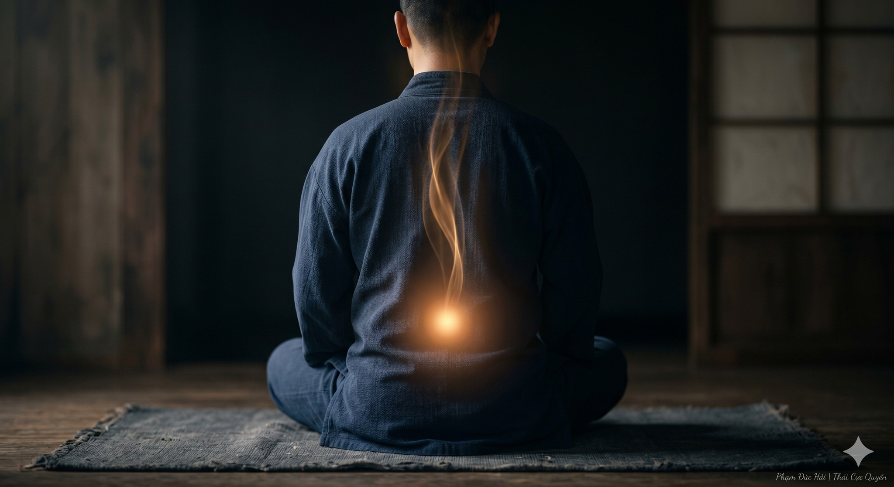

# THẬN KHÍ VÀ SỨC MẠNH THẮT LƯNG

> 📅 *May 28, 2026 9:19:47 am* · 📸 1 ảnh · 🎬 0 video

[← Quay lại danh sách bài viết](../index.md)

---

Thắt lưng là nhà
của tạng Thận
Khi thắt lưng đau
là khi ngôi nhà
đang bị lung lay
khí huyết chẳng thông

MỆNH MÔN HỎA

Nằm tại thắt lưng
là cửa Mệnh môn
nơi giữ ngọn lửa
của sự sống
Lửa có ấm nóng
thân mới dẻo dai
Hệ trục mới vững

SAI LỆCH HỆ TRỤC

Thói quen ngồi gập
làm thắt lưng bó cứng
vùi lấp Mệnh môn
Khi lửa bị tắt
Dương khí không thăng
làm lưng đau mỏi
thần trí uể oải

MỞ LƯNG DƯỠNG THẬN

Trong Dưỡng Sinh Công
ta luyện mở lưng
để cửa Mệnh môn
không bị đóng kín
Dẫn hỏa về gốc
nuôi dưỡng Thận tinh
Giúp thắt lưng dẻo
trục tự thẳng hàng

VẬN HÀNH TỰ NHIÊN

Đừng gồng thắt lưng
Hãy thả lỏng ra
để hơi thở chìm
xuống tận đáy lưng
Khi Thận khí vững
bước đi nhẹ tênh
sức sống tràn đầy

CHO NÊN

Thắt lưng dẻo nhờ Thận.
Thận khỏe nhờ Trục thông.
Giữ ấm Mệnh môn
là giữ gìn sinh mệnh.

Phạm Đức Hải | Thái Cực Quyền/\THẬN KHÍ VÀ SỨC MẠNH THẮT LƯNGThắt lưng là nhàcủa tạng ThậnKhi thắt lưng đaulà khi ngôi nhàđang bị lung laykhí huyết chẳng thôngMỆNH MÔN HỎANằm tại thắt lưnglà cửa Mệnh mônnơi giữ ngọn lửacủa sự sốngLửa có ấm nóngthân mới dẻo daiHệ trục mới vữngSAI LỆCH HỆ TRỤCThói quen ngồi gậplàm thắt lưng bó cứngvùi lấp Mệnh mônKhi lửa bị tắtDương khí không thănglàm lưng đau mỏithần trí uể oảiMỞ LƯNG DƯỠNG THẬNTrong Dưỡng Sinh Côngta luyện mở lưngđể cửa Mệnh mônkhông bị đóng kínDẫn hỏa về gốcnuôi dưỡng Thận tinhGiúp thắt lưng dẻotrục tự thẳng hàngVẬN HÀNH TỰ NHIÊNĐừng gồng thắt lưngHãy thả lỏng rađể hơi thở chìmxuống tận đáy lưngKhi Thận khí vữngbước đi nhẹ tênhsức sống tràn đầyCHO NÊNThắt lưng dẻo nhờ Thận.Thận khỏe nhờ Trục thông.Giữ ấm Mệnh mônlà giữ gìn sinh mệnh.Phạm Đức Hải | Thái Cực Quyền/\