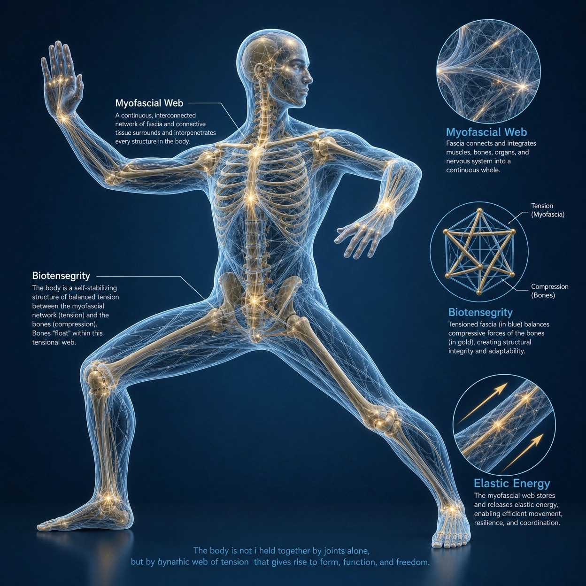

# The Harvard Medical School Guide to Tai Chi by Dr. Peter M. Wayne. He brings together cutting-edge medical research with ancient wisdom to present Tai Chi as a practical, evidence-based approach to...

> 📅 *Thứ Tư 27/05/2026 14:14* · 📸 1 ảnh

[← Quay lại danh sách bài viết](../index.md)

---

The Harvard Medical School Guide to Tai Chi by Dr. Peter M. Wayne. He brings together cutting-edge medical research with ancient wisdom to present Tai Chi as a practical, evidence-based approach to health and wellness.  Below is an interactive website to apply.   https://taichinow-8e3yvqqu.manus.space

With over 35 years of training experience and as Assistant Professor of Medicine at Harvard Medical School, Dr. Wayne has developed a 12-week program that demonstrates how regular Tai Chi practice leads to improved balance, cardiovascular health, mental clarity, and overall well-being.

Suitable for all ages and fitness levels and can be practiced in just a few minutes a day. The full text from his ebook is here:
https://drive.google.com/file/d/1IXVWgrPmwbun1QmVv0J5sMIy9pO9JW06/view?usp=sharing