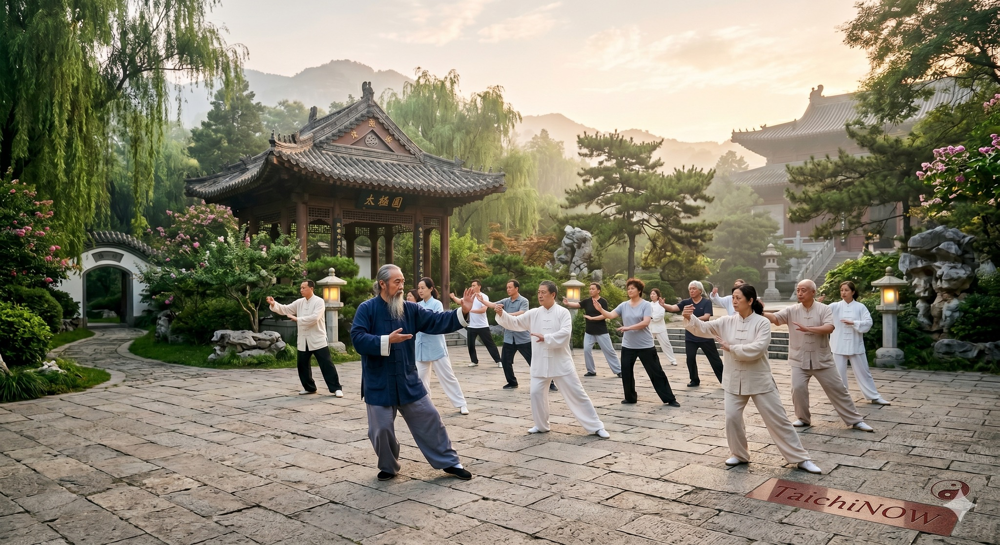

# THÁI CỰC LÀ GỐC CỦA ĐỘNG TĨNH

> 📅 *Thứ Tư 27/05/2026 07:03* · 📸 1 ảnh

[← Quay lại danh sách bài viết](../index.md)

---

Nhiều người nhìn
Thái Cực Quyền
thường chỉ thấy
sự chậm chạp
hay những bài múa
Nhưng trong Luận
đó không phải múa
mà là đạo
vận hành sinh mệnh

ÂM DƯƠNG CHI MẪU

Thái cực là gì?
Là từ Vô cực sinh ra
Là mẹ của Âm Dương
Trong cơ thể ta
Âm và Dương
luôn xoay chuyển
Nếu mất cân bằng
thân sẽ loạn
tâm sẽ mệt

ĐỘNG TĨNH CHI CƠ

Luận viết rằng
Động thì phân chia
Tĩnh thì hợp lại
Người hiện đại
luôn Động mà không Tĩnh
Khí luôn bốc lên
không có chỗ về
Thái Cực dạy ta
trong Động có Tĩnh
trong Tĩnh có Động
để giữ lấy cái gốc

VẬN HÀNH TỰ NHIÊN
Đừng cố dùng lực
Đừng cố gồng lên
Sức mạnh thật sự
đến từ sự thả lỏng
Cơ thể như dòng nước
chảy trôi tự nhiên
không bị vít lấp
Khi thân không căng
khí mới tự lưu

GIỮ LẤY HỆ TRỤC

Cổ nhân dạy
Lập thân trung chính
Không nghiêng không lệch
Khi trục thân vững
trọng tâm được giữ
Khí mới tụ về Đan điền
Thần mới yên ở Tâm
Mọi chuyển động
đều bắt nguồn từ gốc

KHÔNG PHẢI TẬP CHIÊU
MÀ LÀ LUYỆN DÒNG

Nhiều người mải mê
theo đuổi chiêu thức
Nhưng quên mất
cái dòng chảy bên trong
Nếu dòng không thông
chiêu chỉ là vỏ
Thái cực thật sự
là làm cho dòng chảy
không bao giờ dứt

CHO NÊN 

Không phải tập để mạnh hơn
mà để bớt gồng đi.
Không phải tìm lực ở ngoài
mà là giữ gốc ở trong.
Thái Cực Quyền Luận
chính là tấm bản đồ
để ta trở về
với sự vận hành tự nhiên nhất.

Phạm Đức Hải | Thái Cực Quyền