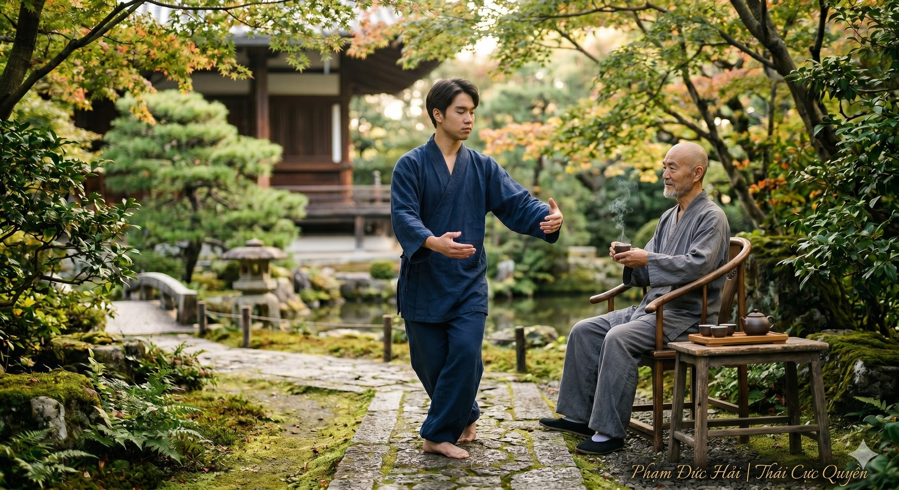

# Trà Và Tĩnh Lặng - Câu chuyện giữa Thiền sư Vô Ngôn và người học trò Thái Cực.

> 📅 *Jun 02, 2026 11:20:59 am* · 📸 1 ảnh · 🎬 0 video

[← Quay lại danh sách bài viết](../index.md)

---

Buổi sáng sớm. Sương còn đọng trên mái ngói cũ của thiền thất. Minh - người học trò đã luyện Thái Cực Quyền được mười lăm năm - bước vào, tay cầm một tập giấy dày, mắt có vẻ bồn chồn khác thường.
Thiền sư Vô Ngôn đang ngồi pha trà. Ông không ngước nhìn lên.

Minh: Thưa Thầy, con vừa đọc xong ba cuốn sách về sinh cơ học Thái Cực. Con đã ghi chép đầy đủ, phân loại theo từng khớp xương, từng nhóm cơ, từng góc lực tác động...
(Minh đặt tập giấy xuống bàn, nhìn Thầy với ánh mắt chờ đợi khen ngợi.)
Vô Ngôn: (vẫn rót trà, giọng nhẹ như hơi nước) Con uống trà không?
Minh: (hơi ngạc nhiên) Dạ... uống, Thầy.
(Vô Ngôn rót trà vào chén của Minh. Rót mãi. Trà tràn ra bàn, ướt cả tập giấy.)
Minh: (hốt hoảng) Thầy! Trà tràn rồi!
Vô Ngôn: (nhẹ nhàng đặt ấm xuống) Ừ. Chén đã đầy thì không nhận thêm được nữa. Tập giấy của con cũng vậy.

(Một khoảnh khắc im lặng. Minh lau tập giấy, ngồi xuống, vẻ suy nghĩ.)
Minh: Thầy muốn nói... con đang tích lũy quá nhiều mà không tiêu hóa được?
Vô Ngôn: Ta muốn hỏi con một điều trước. Hôm qua con luyện quyền không?
Minh: Dạ có. Một tiếng đồng hồ.
Vô Ngôn: Khi con đứng vào tấn Khai Thái Cực, trong đầu con nghĩ gì?
Minh: (thành thật) Con... con đang ôn lại những gì đọc được. Về trọng tâm phải đặt ở Đan Điền. Về đầu gối không được vượt qua mũi chân. Về vai phải buông xuống theo đúng nguyên lý fascia...
Vô Ngôn: (gật đầu chậm rãi) Con đang luyện quyền hay đang luyện sách?

(Minh im lặng. Một câu hỏi đơn giản nhưng như mũi kim đâm vào chỗ đau.)
Minh: (khẽ) Thưa Thầy... hai cái đó khác nhau như thế nào? Hiểu lý thuyết chẳng phải là để hỗ trợ thực hành sao?
Vô Ngôn: Có một người thợ rèn già được hỏi bí quyết làm kiếm. Ông nói: "Tôi không thể nói cho anh biết. Không nóng quá, không nguội quá - chính tay tôi cảm nhận được lúc nào là đúng. Con trai tôi hỏi tôi điều này suốt hai mươi năm. Tôi già rồi mà vẫn không giải thích được." Con hiểu câu chuyện đó không?
Minh: Hiểu biết đó... không truyền đạt được bằng lời?
Vô Ngôn: Không truyền đạt được bằng chữ. Chỉ truyền được qua thân. Qua trải nghiệm. Người thợ rèn đó không cần đọc ba cuốn sách về kim loại học. Ông ta là kiếm - trong tay ông, trong lửa ông, trong hơi thở ông lúc quai búa.

Minh: (trầm ngâm) Nhưng Thầy ơi, thế giới bây giờ khác rồi. Có quá nhiều thông tin. Nếu con không chủ động học, con sẽ bị tụt lại...
Vô Ngôn: (nhấc chén trà lên, nhìn ánh sáng xuyên qua) Con thấy ánh sáng qua chén trà này không?
Minh: Thấy.
Vô Ngôn: Nếu ta đổ mực vào chén, con còn thấy ánh sáng không?
Minh: Không.
Vô Ngôn: Tâm trí con hiện tại là chén mực. Không phải vì con dốt. Mà vì con đổ quá nhiều thứ vào đó mà chưa bao giờ để nó lắng.

Minh: (nhỏ giọng) Thầy... con cảm thấy nếu không đọc, không học, không ghi chép... con sẽ không tiến bộ. Nỗi sợ đó rất thật.
Vô Ngôn: (nhìn thẳng vào mắt Minh lần đầu tiên trong buổi gặp) Nỗi sợ đó — con có cảm thấy nó trong cơ thể không? Nó đang ở đâu?
Minh: (dừng lại, đặt tay lên ngực) Ở... đây. Hơi thắt lại.
Vô Ngôn: Khi con đứng Thôi Thủ với đối luyện, con có cho phép mình cảm thấy nỗi sợ đó không?
Minh: Không được. Nếu còn sợ, con sẽ cứng. Mà cứng thì bị đẩy ngã.
Vô Ngôn: Đúng vậy. (dừng lâu) Vậy thì trong việc học... tại sao con lại cho phép nỗi sợ đó cầm lái?

(Minh không trả lời được ngay. Bên ngoài, một cơn gió nhẹ lay động những chiếc lá trước cửa.)
Minh: (sau một hồi lâu) Thầy... vậy con phải làm gì? Bỏ sách đi?
Vô Ngôn: (cười khẽ - đây là lần đầu tiên ông cười) Lão Tử nói: "Vi học nhật ích, vi Đạo nhật tổn." Đuổi theo cái học bên ngoài thì ngày một thêm. Theo đuổi cái Đạo bên trong thì ngày một bớt. Con hiểu "bớt" ở đây nghĩa là gì không?
Minh: Buông bỏ... những định kiến? Những khuôn mẫu đã học?
Vô Ngôn: Buông bỏ cái cần phải biết. Buông bỏ cái sợ không biết đủ. Sách không có tội. Chữ không có tội. Nhưng khi con đọc sách để lấp đầy nỗi sợ thay vì nuôi dưỡng sự hiểu biết - lúc đó sách trở thành xiềng xích.

Minh: Thầy có thể cho con một ví dụ cụ thể không? Làm thế nào là học đúng cách?
Vô Ngôn: Con biết bài Vân Thủ không?
Minh: Dạ biết. Con tập hàng ngày.
Vô Ngôn: Tuần tới, mỗi buổi sáng con chỉ tập duy nhất một động tác đó. Ba mươi phút. Không nghĩ về sách. Không nghĩ về kỹ thuật. Chỉ chú ý đến bàn tay chuyển động trong không khí. Cảm nhận kháng lực của không khí. Cảm nhận trọng tâm dịch chuyển trong lòng bàn chân. Chỉ vậy thôi.
Minh: Chỉ... một động tác? Một tuần?
Vô Ngôn: Thầy Trương Tam Phong mất ba mươi năm để hiểu một chữ Tùng. Con nghĩ một tuần với một động tác là nhiều hay ít?

(Minh gật đầu chậm. Lần này không phải vì hiểu lý thuyết. Mà vì cảm được điều gì đó.)
Minh: Thầy... con bắt đầu hiểu. Nhưng con vẫn còn một câu hỏi. Người ta nói kiến thức là sức mạnh. Nếu con buông bỏ việc tích lũy... con có tụt lại phía sau không?
Vô Ngôn: (đứng dậy, bước ra cửa nhìn khoảng sân) Con thấy cây tre kia không?
Minh: Thấy.
Vô Ngôn: Khi bão đến, cây nào đứng vững hơn - cây sồi cứng hay cây tre rỗng ruột?
Minh: Cây tre. Nó uốn theo gió mà không gãy.
Vô Ngôn: Rỗng ruột không có nghĩa là trống không có gì. Nó có rễ. Rễ ăn sâu xuống đất. Cái "rỗng" bên trên chính là điều cho phép nó cảm nhận hướng gió và điều chỉnh theo. Nếu nhồi bê tông vào trong ruột tre, nó sẽ cứng hơn và... gãy trong bão đầu tiên.

Minh: (nhỏ giọng, như đang nói với chính mình) Tích lũy kiến thức là nhồi bê tông vào trong ruột...
Vô Ngôn: Nếu không có sự tiêu hóa, không có khoảng lặng, không có trải nghiệm thực - đúng vậy.
Minh: Còn... trí tuệ đích thực là gì? Là cái rễ?
Vô Ngôn: (quay lại, ngồi xuống) Trí tuệ đích thực là lúc con không cần phải nghĩ rằng mình biết. Con là cái biết đó. Như người thợ rèn kia - ông không giải thích được, nhưng ông biết. Và cái biết đó không nằm trong tập giấy của ông. Nó nằm trong đôi tay. Trong hơi thở. Trong năm mươi năm cầm búa.

(Hai thầy trò ngồi im. Tiếng chim từ đâu đó vọng lại. Ấm trà bốc khói nhẹ.)
Minh: Thầy... hôm nay con đến đây với một tập ghi chép dày. Con ra về với... (nhìn xuống bàn tay trống) ...không có gì.
Vô Ngôn: (gật đầu, giọng ấm) Không có gì - hay là bắt đầu có khoảng trống để chứa điều gì đó thật hơn?
Minh: (mỉm cười lần đầu tiên) Con hiểu rồi. Hay... có lẽ con sắp hiểu.
Vô Ngôn: Câu đó mới đúng hơn câu trước. (ông rót thêm trà vào chén Minh - lần này chén còn đủ khoảng trống để nhận) Uống trà đi đã.

Minh uống trà. Không nghĩ về sinh cơ học. Không nghĩ về các chương sách. Chỉ cảm nhận hơi ấm lan từ chén sứ vào lòng bàn tay.
Đó có lẽ là bài học Thái Cực đầu tiên thật sự thấm vào người anh.Trà Và Tĩnh Lặng - Câu chuyện giữa Thiền sư Vô Ngôn và người học trò Thái Cực.Buổi sáng sớm. Sương còn đọng trên mái ngói cũ của thiền thất. Minh - người học trò đã luyện Thái Cực Quyền được mười lăm năm - bước vào, tay cầm một tập giấy dày, mắt có vẻ bồn chồn khác thường.Thiền sư Vô Ngôn đang ngồi pha trà. Ông không ngước nhìn lên.Minh: Thưa Thầy, con vừa đọc xong ba cuốn sách về sinh cơ học Thái Cực. Con đã ghi chép đầy đủ, phân loại theo từng khớp xương, từng nhóm cơ, từng góc lực tác động...(Minh đặt tập giấy xuống bàn, nhìn Thầy với ánh mắt chờ đợi khen ngợi.)Vô Ngôn: (vẫn rót trà, giọng nhẹ như hơi nước) Con uống trà không?Minh: (hơi ngạc nhiên) Dạ... uống, Thầy.(Vô Ngôn rót trà vào chén của Minh. Rót mãi. Trà tràn ra bàn, ướt cả tập giấy.)Minh: (hốt hoảng) Thầy! Trà tràn rồi!Vô Ngôn: (nhẹ nhàng đặt ấm xuống) Ừ. Chén đã đầy thì không nhận thêm được nữa. Tập giấy của con cũng vậy.(Một khoảnh khắc im lặng. Minh lau tập giấy, ngồi xuống, vẻ suy nghĩ.)Minh: Thầy muốn nói... con đang tích lũy quá nhiều mà không tiêu hóa được?Vô Ngôn: Ta muốn hỏi con một điều trước. Hôm qua con luyện quyền không?Minh: Dạ có. Một tiếng đồng hồ.Vô Ngôn: Khi con đứng vào tấn Khai Thái Cực, trong đầu con nghĩ gì?Minh: (thành thật) Con... con đang ôn lại những gì đọc được. Về trọng tâm phải đặt ở Đan Điền. Về đầu gối không được vượt qua mũi chân. Về vai phải buông xuống theo đúng nguyên lý fascia...Vô Ngôn: (gật đầu chậm rãi) Con đang luyện quyền hay đang luyện sách?(Minh im lặng. Một câu hỏi đơn giản nhưng như mũi kim đâm vào chỗ đau.)Minh: (khẽ) Thưa Thầy... hai cái đó khác nhau như thế nào? Hiểu lý thuyết chẳng phải là để hỗ trợ thực hành sao?Vô Ngôn: Có một người thợ rèn già được hỏi bí quyết làm kiếm. Ông nói: "Tôi không thể nói cho anh biết. Không nóng quá, không nguội quá - chính tay tôi cảm nhận được lúc nào là đúng. Con trai tôi hỏi tôi điều này suốt hai mươi năm. Tôi già rồi mà vẫn không giải thích được." Con hiểu câu chuyện đó không?Minh: Hiểu biết đó... không truyền đạt được bằng lời?Vô Ngôn: Không truyền đạt được bằng chữ. Chỉ truyền được qua thân. Qua trải nghiệm. Người thợ rèn đó không cần đọc ba cuốn sách về kim loại học. Ông ta là kiếm - trong tay ông, trong lửa ông, trong hơi thở ông lúc quai búa.Minh: (trầm ngâm) Nhưng Thầy ơi, thế giới bây giờ khác rồi. Có quá nhiều thông tin. Nếu con không chủ động học, con sẽ bị tụt lại...Vô Ngôn: (nhấc chén trà lên, nhìn ánh sáng xuyên qua) Con thấy ánh sáng qua chén trà này không?Minh: Thấy.Vô Ngôn: Nếu ta đổ mực vào chén, con còn thấy ánh sáng không?Minh: Không.Vô Ngôn: Tâm trí con hiện tại là chén mực. Không phải vì con dốt. Mà vì con đổ quá nhiều thứ vào đó mà chưa bao giờ để nó lắng.Minh: (nhỏ giọng) Thầy... con cảm thấy nếu không đọc, không học, không ghi chép... con sẽ không tiến bộ. Nỗi sợ đó rất thật.Vô Ngôn: (nhìn thẳng vào mắt Minh lần đầu tiên trong buổi gặp) Nỗi sợ đó — con có cảm thấy nó trong cơ thể không? Nó đang ở đâu?Minh: (dừng lại, đặt tay lên ngực) Ở... đây. Hơi thắt lại.Vô Ngôn: Khi con đứng Thôi Thủ với đối luyện, con có cho phép mình cảm thấy nỗi sợ đó không?Minh: Không được. Nếu còn sợ, con sẽ cứng. Mà cứng thì bị đẩy ngã.Vô Ngôn: Đúng vậy. (dừng lâu) Vậy thì trong việc học... tại sao con lại cho phép nỗi sợ đó cầm lái?(Minh không trả lời được ngay. Bên ngoài, một cơn gió nhẹ lay động những chiếc lá trước cửa.)Minh: (sau một hồi lâu) Thầy... vậy con phải làm gì? Bỏ sách đi?Vô Ngôn: (cười khẽ - đây là lần đầu tiên ông cười) Lão Tử nói: "Vi học nhật ích, vi Đạo nhật tổn." Đuổi theo cái học bên ngoài thì ngày một thêm. Theo đuổi cái Đạo bên trong thì ngày một bớt. Con hiểu "bớt" ở đây nghĩa là gì không?Minh: Buông bỏ... những định kiến? Những khuôn mẫu đã học?Vô Ngôn: Buông bỏ cái cần phải biết. Buông bỏ cái sợ không biết đủ. Sách không có tội. Chữ không có tội. Nhưng khi con đọc sách để lấp đầy nỗi sợ thay vì nuôi dưỡng sự hiểu biết - lúc đó sách trở thành xiềng xích.Minh: Thầy có thể cho con một ví dụ cụ thể không? Làm thế nào là học đúng cách?Vô Ngôn: Con biết bài Vân Thủ không?Minh: Dạ biết. Con tập hàng ngày.Vô Ngôn: Tuần tới, mỗi buổi sáng con chỉ tập duy nhất một động tác đó. Ba mươi phút. Không nghĩ về sách. Không nghĩ về kỹ thuật. Chỉ chú ý đến bàn tay chuyển động trong không khí. Cảm nhận kháng lực của không khí. Cảm nhận trọng tâm dịch chuyển trong lòng bàn chân. Chỉ vậy thôi.Minh: Chỉ... một động tác? Một tuần?Vô Ngôn: Thầy Trương Tam Phong mất ba mươi năm để hiểu một chữ Tùng. Con nghĩ một tuần với một động tác là nhiều hay ít?(Minh gật đầu chậm. Lần này không phải vì hiểu lý thuyết. Mà vì cảm được điều gì đó.)Minh: Thầy... con bắt đầu hiểu. Nhưng con vẫn còn một câu hỏi. Người ta nói kiến thức là sức mạnh. Nếu con buông bỏ việc tích lũy... con có tụt lại phía sau không?Vô Ngôn: (đứng dậy, bước ra cửa nhìn khoảng sân) Con thấy cây tre kia không?Minh: Thấy.Vô Ngôn: Khi bão đến, cây nào đứng vững hơn - cây sồi cứng hay cây tre rỗng ruột?Minh: Cây tre. Nó uốn theo gió mà không gãy.Vô Ngôn: Rỗng ruột không có nghĩa là trống không có gì. Nó có rễ. Rễ ăn sâu xuống đất. Cái "rỗng" bên trên chính là điều cho phép nó cảm nhận hướng gió và điều chỉnh theo. Nếu nhồi bê tông vào trong ruột tre, nó sẽ cứng hơn và... gãy trong bão đầu tiên.Minh: (nhỏ giọng, như đang nói với chính mình) Tích lũy kiến thức là nhồi bê tông vào trong ruột...Vô Ngôn: Nếu không có sự tiêu hóa, không có khoảng lặng, không có trải nghiệm thực - đúng vậy.Minh: Còn... trí tuệ đích thực là gì? Là cái rễ?Vô Ngôn: (quay lại, ngồi xuống) Trí tuệ đích thực là lúc con không cần phải nghĩ rằng mình biết. Con là cái biết đó. Như người thợ rèn kia - ông không giải thích được, nhưng ông biết. Và cái biết đó không nằm trong tập giấy của ông. Nó nằm trong đôi tay. Trong hơi thở. Trong năm mươi năm cầm búa.(Hai thầy trò ngồi im. Tiếng chim từ đâu đó vọng lại. Ấm trà bốc khói nhẹ.)Minh: Thầy... hôm nay con đến đây với một tập ghi chép dày. Con ra về với... (nhìn xuống bàn tay trống) ...không có gì.Vô Ngôn: (gật đầu, giọng ấm) Không có gì - hay là bắt đầu có khoảng trống để chứa điều gì đó thật hơn?Minh: (mỉm cười lần đầu tiên) Con hiểu rồi. Hay... có lẽ con sắp hiểu.Vô Ngôn: Câu đó mới đúng hơn câu trước. (ông rót thêm trà vào chén Minh - lần này chén còn đủ khoảng trống để nhận) Uống trà đi đã.Minh uống trà. Không nghĩ về sinh cơ học. Không nghĩ về các chương sách. Chỉ cảm nhận hơi ấm lan từ chén sứ vào lòng bàn tay.Đó có lẽ là bài học Thái Cực đầu tiên thật sự thấm vào người anh.