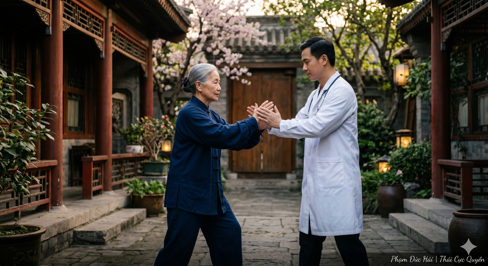

# Trà Và Tĩnh Lặng (Phần II)

> 📅 *Jun 02, 2026 1:53:00 pm* · 📸 1 ảnh · 🎬 0 video

[← Quay lại danh sách bài viết](../index.md)

---

Câu chuyện tiếp theo giữa Thiền sư Vô Ngôn và người học trò Thái Cực

Một tuần trôi qua.
Minh trở lại thiền thất vào buổi sáng thứ Bảy. Lần này không mang tập giấy. Chỉ mang theo một câu hỏi và cái câu hỏi đó đã giữ anh thức suốt mấy đêm liền.
Vô Ngôn đang ngồi trong sân, lưng thẳng, mắt nhắm, hai bàn tay đặt nhẹ lên đùi. Ông không luyện quyền. Không tụng kinh. Chỉ... ngồi. Như một tảng đá biết thở.
Minh đứng ở cổng, không dám bước vào, sợ làm vỡ cái gì đó mà anh không nhìn thấy nhưng cảm nhận được.
Vài phút sau, Vô Ngôn mở mắt.

Vô Ngôn: Vào đi. Thầy không ngủ.
Minh: (bước vào, ngồi xuống chiếc ghế quen thuộc) Con xin lỗi vì đã làm phiền Thầy.
Vô Ngôn: Con không làm phiền gì cả. Con chỉ đang tự làm phiền chính mình vì đứng đó lo lắng thay vì bước vào. (nhìn Minh) Tuần rồi thế nào?
Minh: (thở dài) Kỳ lạ lắm, Thầy. Ba ngày đầu con làm theo lời Thầy dặn chỉ tập Vân Thủ, ba mươi phút, không nghĩ về kỹ thuật. Nhưng con không chịu được. Đầu óc cứ tự động chạy về những gì đã đọc. "Vai phải buông. Khuỷu tay hơi chìm xuống. Trọng tâm..."
Vô Ngôn: Và con làm gì với những suy nghĩ đó?
Minh: Con... cố đuổi chúng đi. Càng đuổi càng nhiều hơn. Giống như đang dẹp kiến - dẹp chỗ này, chỗ khác lại nổi lên.
Vô Ngôn: (gật đầu chậm) Và từ ngày thứ tư?
Minh: (ngập ngừng) Con... con bỏ cuộc kiểu đó. Con thôi không đuổi nữa. Con cứ để những suy nghĩ đó đến, nhưng con không đi theo chúng. Con nhìn chúng như nhìn mây trôi. Và lạ thay... bàn tay con bắt đầu chuyển động khác đi.
Vô Ngôn: Khác như thế nào?
Minh: (nhìn xuống bàn tay mình, tìm từ) Chậm hơn. Nhưng không phải chậm vì cố ý. Chậm vì... bàn tay tự biết chậm lại. Con cảm nhận được không khí cản lại khi tay đẩy ra. Con cảm nhận được lúc trọng tâm muốn đổ sang phải trước khi nó đổ. Con chưa bao giờ cảm nhận được điều đó dù tập mười lăm năm.
(Một khoảng lặng. Vô Ngôn không nói gì, chỉ nhìn Minh với ánh mắt bình thản.)
Minh: Thầy... đó có phải là cái mà người ta gọi là thấu hiểu không?

Vô Ngôn: (đứng dậy, bước vào trong, giọng vọng ra) Chờ Thầy một chút.
(Ông trở ra với một tấm gương nhỏ, đặt xuống bàn giữa hai thầy trò.)
Vô Ngôn: Con nhìn vào gương và thấy gì?
Minh: Thấy... mặt con.
Vô Ngôn: Gương có cố gắng phản chiếu không?
Minh: Không. Nó chỉ... phản chiếu thôi. Tự nhiên.
Vô Ngôn: Nếu ta phủ bùn lên mặt gương thì sao?
Minh: Thì không còn thấy gì nữa.
Vô Ngôn: Kiến thức cơ học - những ghi chú, những phân loại, những công thức chưa được tiêu hóa - chính là lớp bùn đó. Không phải vì chúng xấu. Mà vì chúng che mặt gương. (dừng lại) Cái mà con vừa trải nghiệm trong bảy ngày qua - lúc bàn tay tự biết chậm lại, lúc con cảm nhận được trọng tâm trước khi nó đổ - đó là lúc gương được lau sạch một chút. Đó không phải là đỉnh cao. Đó chỉ là... con bắt đầu thấy mặt gương.

Minh: Nhưng Thầy ơi (giọng anh có chút gì đó vẫn còn vướng mắc) con vẫn chưa hiểu một điều. Nếu kiến thức cơ học chỉ là lớp bùn, vậy tại sao chúng ta vẫn phải học? Tại sao không bỏ hết sách vở đi, chỉ ra sân tập?
Vô Ngôn: (nhìn ra khoảng sân, nơi cây tre đứng im trong nắng sớm) Con thấy cây tre đó không?
Minh: Thấy. Tuần trước Thầy cũng hỏi về nó.
Vô Ngôn: Tuần trước ta hỏi về cái rỗng bên trong. Hôm nay ta hỏi về cái khác. Mùa xuân năm ngoái, con có nhớ trời mưa lớn liên tục ba tuần không?
Minh: Dạ nhớ. Ngập lụt khắp nơi.
Vô Ngôn: Cây tre đó có bị bật gốc không?
Minh: Không.
Vô Ngôn: Vì sao? Vì nó rỗng ruột - nhẹ hơn cây sồi, đúng không? Nhưng không chỉ vậy. Rễ nó ăn sâu. Và rễ đó tốn nhiều năm để mọc xuống. Kiến thức khi được học đúng cách chính là rễ. Nó không hiện ra trên mặt đất. Không ai nhìn thấy. Nhưng nó là thứ giữ cây đứng vững trong bão. (quay lại nhìn Minh) Vấn đề của con không phải là học quá nhiều. Vấn đề là con học nhưng không cho rễ mọc xuống. Con cứ đặt sách lên sách, ghi chú lên ghi chú - tất cả nằm trên mặt đất, chờ gió thổi bay.
Minh: Vậy làm thế nào để... cho rễ mọc xuống?

Vô Ngôn: Hãy để Thầy kể cho con nghe về một người học trò khác của Thầy - cách đây đã lâu lắm rồi.
(Ông nhấp một ngụm trà, nhìn ra xa như đang nhìn về một thời điểm khác.)
Vô Ngôn: Anh ta là bác sĩ. Thông minh hơn con nhiều - đọc một lần là nhớ, phân tích nhanh, lý luận sắc bén. Anh ta học Thái Cực với sư phụ của Thầy, và sau hai năm anh ta có thể giải thích mọi động tác bằng ngôn ngữ y học - cơ delta, gân Achilles, dây thần kinh ngoại vi - nghe rất ấn tượng.
Minh: Chắc tiến bộ nhanh lắm?
Vô Ngôn: (lắc đầu khẽ) Trong Thôi Thủ, anh ta thua một bà cụ sáu mươi lăm tuổi, chưa học một ngày y khoa nào trong đời. Bà cụ đó học quyền từ hồi còn trẻ, không hiểu gì về cơ học, không đọc một cuốn sách nào. Nhưng khi anh ta đẩy vào người bà - lực biến mất. Như đẩy vào nước. Và một cái gì đó rất nhẹ, rất tinh tế phản lại, khiến anh ta mất thăng bằng mà không biết từ đâu.
Minh: (thầm thì) Bà cụ đó...
Vô Ngôn: Bà cụ đó không biết giải thích. Nhưng bà là Thái Cực. Còn anh bác sĩ - anh ta biết về Thái Cực. Hai chữ "là" và "biết về" - khoảng cách đó, con ơi, là cả một đời người.

(Minh ngồi yên lặng một lúc dài. Bên ngoài, tiếng lá cây xào xạc.)
Minh: Thầy... con muốn hỏi một điều thật hơn. Thật ra con sợ rằng nếu con buông - buông việc tích lũy, buông việc kiểm soát - con sẽ trở nên... tầm thường. Người khác sẽ biết nhiều hơn con. Con sẽ không theo kịp.
(Vô Ngôn không trả lời ngay. Ông đứng dậy, bước chậm vào góc sân, cúi xuống nhặt một viên đá nhỏ. Ông trở lại, đặt viên đá lên bàn tay và giơ ra trước mặt Minh.)
Vô Ngôn: Đây là nỗi sợ của con. Con thấy nó không?
Minh: (nhìn viên đá) Thầy muốn nói...
Vô Ngôn: Nỗi sợ bị tụt lại - con đang mang nó trong từng bước quyền. Trong từng trang sách con đọc. Nó nặng không?
Minh: (sau một hồi) Nặng lắm, Thầy.
Vô Ngôn: (thả viên đá xuống đất) Nỗi sợ đó không bảo vệ con. Nó chỉ làm con cứng. Mà cứng thì bị đẩy ngã - con tự nói với Thầy điều đó tuần trước mà.
(Minh nhìn viên đá nằm dưới đất. Anh cúi xuống nhặt lên, rồi sau một thoáng do dự - thả ra.)

Minh: Thầy... nếu buông nỗi sợ đó, con sẽ thay nó bằng gì?
Vô Ngôn: (lần đầu tiên trong buổi sáng hôm đó, ông hỏi ngược lại) Con nghĩ là gì?
Minh: (suy nghĩ thật lâu, nhìn xuống đôi bàn tay) Sự... tò mò? Không phải tò mò để tích lũy. Mà tò mò như... như lần đầu tiên con nhìn thấy tuyết rơi hồi nhỏ. Không cần biết tuyết cấu tạo từ gì. Chỉ muốn đưa tay ra hứng và cảm nhận.
(Vô Ngôn gật đầu. Chậm. Và lần này ánh mắt ông có gì đó ấm hơn những lần trước.)
Vô Ngôn: Bây giờ con mới thật sự bắt đầu học Thái Cực.

Minh: Thầy... con còn một câu hỏi cuối. Thầy đã đạt đến trí tuệ đích thực chưa? Thầy có biết lúc nào mình thật sự hiểu không?
(Khoảng lặng dài. Một chú chim sẻ sà xuống mép bàn, nhảy vài bước, rồi bay đi.)
Vô Ngôn: (nhìn theo con chim) Khi Thầy còn trẻ, Thầy nghĩ sự giác ngộ là một cái đích - một nơi chốn mà khi đến nơi, mình sẽ biết rằng mình đã đến. Thầy luyện tập điên cuồng. Đọc kinh điển. Hỏi các sư phụ khắp nơi. Cố thu thập càng nhiều càng tốt, như thể trí tuệ là thứ có thể nhồi vào một cái túi mang theo.
Minh: Rồi Thầy nhận ra điều gì?
Vô Ngôn: Rằng câu hỏi "Tôi đã hiểu chưa?" chính là bằng chứng rõ ràng nhất rằng mình chưa hiểu. (ngừng lại) Người thật sự hiểu không đặt câu hỏi đó - không phải vì họ kiêu ngạo, mà vì câu hỏi đó không còn xuất hiện trong tâm trí họ nữa. Như bàn tay con trong bảy ngày qua - khi con thôi cố gắng biết cách chuyển động đúng, bàn tay tự tìm ra đường của nó. Đó là lúc sự hiểu biết đang hoạt động - im lặng, không tên gọi, không cần được xác nhận.

(Mặt trời đã lên cao. Sương tan hết. Minh ngồi đó, không vội về, chỉ nhìn ánh nắng chạy dọc theo những kẽ gạch cũ trong sân thiền thất.)
Minh: Thầy ơi... tuần tới con có thể quay lại không?
Vô Ngôn: (đứng dậy thu dọn chén trà) Con hỏi điều đó như thể Thầy có thể ngăn con vậy.
Minh: (cười khẽ) Con muốn học thêm.
Vô Ngôn: (dừng tay, nhìn Minh) Không. Con muốn bớt đi. Đó mới là học. (ông mang ấm trà vào trong, giọng vọng ra từ bên trong) Và tuần tới - vẫn chỉ Vân Thủ. Nhưng lần này, thử tập lúc trời còn tối, trước khi mặt trời lên. Khi không có gì để nhìn, con sẽ buộc phải cảm.

Minh bước ra cổng thiền thất. Anh không mang theo tập giấy - vì anh không mang nó đến.
Nhưng anh mang theo thứ gì đó nhẹ hơn và kỳ lạ hơn: một khoảng trống nhỏ vừa được dọn ra bên trong ngực. Không đầy. Không vội lấp.
Chỉ... trống. Và sẵn sàng.

Trên đường về, anh đi ngang qua một vũng nước mưa đọng sau đêm qua. Không nghĩ gì, anh dừng lại nhìn.
Trời xanh. Mây trắng. Tất cả in xuống mặt nước phẳng lặng.
Anh đứng đó một lúc - không biết bao lâu - và lần đầu tiên trong nhiều năm, anh không cảm thấy cần phải đi đâu tiếp theo.

"Thượng thiện nhược thủy."
Điều tốt lành cao nhất giống như nước -
nước lợi vạn vật mà không tranh.
- Lão Tử, Đạo Đức Kinh, Chương 8 -Trà Và Tĩnh Lặng (Phần II)Câu chuyện tiếp theo giữa Thiền sư Vô Ngôn và người học trò Thái CựcMột tuần trôi qua.Minh trở lại thiền thất vào buổi sáng thứ Bảy. Lần này không mang tập giấy. Chỉ mang theo một câu hỏi và cái câu hỏi đó đã giữ anh thức suốt mấy đêm liền.Vô Ngôn đang ngồi trong sân, lưng thẳng, mắt nhắm, hai bàn tay đặt nhẹ lên đùi. Ông không luyện quyền. Không tụng kinh. Chỉ... ngồi. Như một tảng đá biết thở.Minh đứng ở cổng, không dám bước vào, sợ làm vỡ cái gì đó mà anh không nhìn thấy nhưng cảm nhận được.Vài phút sau, Vô Ngôn mở mắt.Vô Ngôn: Vào đi. Thầy không ngủ.Minh: (bước vào, ngồi xuống chiếc ghế quen thuộc) Con xin lỗi vì đã làm phiền Thầy.Vô Ngôn: Con không làm phiền gì cả. Con chỉ đang tự làm phiền chính mình vì đứng đó lo lắng thay vì bước vào. (nhìn Minh) Tuần rồi thế nào?Minh: (thở dài) Kỳ lạ lắm, Thầy. Ba ngày đầu con làm theo lời Thầy dặn chỉ tập Vân Thủ, ba mươi phút, không nghĩ về kỹ thuật. Nhưng con không chịu được. Đầu óc cứ tự động chạy về những gì đã đọc. "Vai phải buông. Khuỷu tay hơi chìm xuống. Trọng tâm..."Vô Ngôn: Và con làm gì với những suy nghĩ đó?Minh: Con... cố đuổi chúng đi. Càng đuổi càng nhiều hơn. Giống như đang dẹp kiến - dẹp chỗ này, chỗ khác lại nổi lên.Vô Ngôn: (gật đầu chậm) Và từ ngày thứ tư?Minh: (ngập ngừng) Con... con bỏ cuộc kiểu đó. Con thôi không đuổi nữa. Con cứ để những suy nghĩ đó đến, nhưng con không đi theo chúng. Con nhìn chúng như nhìn mây trôi. Và lạ thay... bàn tay con bắt đầu chuyển động khác đi.Vô Ngôn: Khác như thế nào?Minh: (nhìn xuống bàn tay mình, tìm từ) Chậm hơn. Nhưng không phải chậm vì cố ý. Chậm vì... bàn tay tự biết chậm lại. Con cảm nhận được không khí cản lại khi tay đẩy ra. Con cảm nhận được lúc trọng tâm muốn đổ sang phải trước khi nó đổ. Con chưa bao giờ cảm nhận được điều đó dù tập mười lăm năm.(Một khoảng lặng. Vô Ngôn không nói gì, chỉ nhìn Minh với ánh mắt bình thản.)Minh: Thầy... đó có phải là cái mà người ta gọi là thấu hiểu không?Vô Ngôn: (đứng dậy, bước vào trong, giọng vọng ra) Chờ Thầy một chút.(Ông trở ra với một tấm gương nhỏ, đặt xuống bàn giữa hai thầy trò.)Vô Ngôn: Con nhìn vào gương và thấy gì?Minh: Thấy... mặt con.Vô Ngôn: Gương có cố gắng phản chiếu không?Minh: Không. Nó chỉ... phản chiếu thôi. Tự nhiên.Vô Ngôn: Nếu ta phủ bùn lên mặt gương thì sao?Minh: Thì không còn thấy gì nữa.Vô Ngôn: Kiến thức cơ học - những ghi chú, những phân loại, những công thức chưa được tiêu hóa - chính là lớp bùn đó. Không phải vì chúng xấu. Mà vì chúng che mặt gương. (dừng lại) Cái mà con vừa trải nghiệm trong bảy ngày qua - lúc bàn tay tự biết chậm lại, lúc con cảm nhận được trọng tâm trước khi nó đổ - đó là lúc gương được lau sạch một chút. Đó không phải là đỉnh cao. Đó chỉ là... con bắt đầu thấy mặt gương.Minh: Nhưng Thầy ơi (giọng anh có chút gì đó vẫn còn vướng mắc) con vẫn chưa hiểu một điều. Nếu kiến thức cơ học chỉ là lớp bùn, vậy tại sao chúng ta vẫn phải học? Tại sao không bỏ hết sách vở đi, chỉ ra sân tập?Vô Ngôn: (nhìn ra khoảng sân, nơi cây tre đứng im trong nắng sớm) Con thấy cây tre đó không?Minh: Thấy. Tuần trước Thầy cũng hỏi về nó.Vô Ngôn: Tuần trước ta hỏi về cái rỗng bên trong. Hôm nay ta hỏi về cái khác. Mùa xuân năm ngoái, con có nhớ trời mưa lớn liên tục ba tuần không?Minh: Dạ nhớ. Ngập lụt khắp nơi.Vô Ngôn: Cây tre đó có bị bật gốc không?Minh: Không.Vô Ngôn: Vì sao? Vì nó rỗng ruột - nhẹ hơn cây sồi, đúng không? Nhưng không chỉ vậy. Rễ nó ăn sâu. Và rễ đó tốn nhiều năm để mọc xuống. Kiến thức khi được học đúng cách chính là rễ. Nó không hiện ra trên mặt đất. Không ai nhìn thấy. Nhưng nó là thứ giữ cây đứng vững trong bão. (quay lại nhìn Minh) Vấn đề của con không phải là học quá nhiều. Vấn đề là con học nhưng không cho rễ mọc xuống. Con cứ đặt sách lên sách, ghi chú lên ghi chú - tất cả nằm trên mặt đất, chờ gió thổi bay.Minh: Vậy làm thế nào để... cho rễ mọc xuống?Vô Ngôn: Hãy để Thầy kể cho con nghe về một người học trò khác của Thầy - cách đây đã lâu lắm rồi.(Ông nhấp một ngụm trà, nhìn ra xa như đang nhìn về một thời điểm khác.)Vô Ngôn: Anh ta là bác sĩ. Thông minh hơn con nhiều - đọc một lần là nhớ, phân tích nhanh, lý luận sắc bén. Anh ta học Thái Cực với sư phụ của Thầy, và sau hai năm anh ta có thể giải thích mọi động tác bằng ngôn ngữ y học - cơ delta, gân Achilles, dây thần kinh ngoại vi - nghe rất ấn tượng.Minh: Chắc tiến bộ nhanh lắm?Vô Ngôn: (lắc đầu khẽ) Trong Thôi Thủ, anh ta thua một bà cụ sáu mươi lăm tuổi, chưa học một ngày y khoa nào trong đời. Bà cụ đó học quyền từ hồi còn trẻ, không hiểu gì về cơ học, không đọc một cuốn sách nào. Nhưng khi anh ta đẩy vào người bà - lực biến mất. Như đẩy vào nước. Và một cái gì đó rất nhẹ, rất tinh tế phản lại, khiến anh ta mất thăng bằng mà không biết từ đâu.Minh: (thầm thì) Bà cụ đó...Vô Ngôn: Bà cụ đó không biết giải thích. Nhưng bà là Thái Cực. Còn anh bác sĩ - anh ta biết về Thái Cực. Hai chữ "là" và "biết về" - khoảng cách đó, con ơi, là cả một đời người.(Minh ngồi yên lặng một lúc dài. Bên ngoài, tiếng lá cây xào xạc.)Minh: Thầy... con muốn hỏi một điều thật hơn. Thật ra con sợ rằng nếu con buông - buông việc tích lũy, buông việc kiểm soát - con sẽ trở nên... tầm thường. Người khác sẽ biết nhiều hơn con. Con sẽ không theo kịp.(Vô Ngôn không trả lời ngay. Ông đứng dậy, bước chậm vào góc sân, cúi xuống nhặt một viên đá nhỏ. Ông trở lại, đặt viên đá lên bàn tay và giơ ra trước mặt Minh.)Vô Ngôn: Đây là nỗi sợ của con. Con thấy nó không?Minh: (nhìn viên đá) Thầy muốn nói...Vô Ngôn: Nỗi sợ bị tụt lại - con đang mang nó trong từng bước quyền. Trong từng trang sách con đọc. Nó nặng không?Minh: (sau một hồi) Nặng lắm, Thầy.Vô Ngôn: (thả viên đá xuống đất) Nỗi sợ đó không bảo vệ con. Nó chỉ làm con cứng. Mà cứng thì bị đẩy ngã - con tự nói với Thầy điều đó tuần trước mà.(Minh nhìn viên đá nằm dưới đất. Anh cúi xuống nhặt lên, rồi sau một thoáng do dự - thả ra.)Minh: Thầy... nếu buông nỗi sợ đó, con sẽ thay nó bằng gì?Vô Ngôn: (lần đầu tiên trong buổi sáng hôm đó, ông hỏi ngược lại) Con nghĩ là gì?Minh: (suy nghĩ thật lâu, nhìn xuống đôi bàn tay) Sự... tò mò? Không phải tò mò để tích lũy. Mà tò mò như... như lần đầu tiên con nhìn thấy tuyết rơi hồi nhỏ. Không cần biết tuyết cấu tạo từ gì. Chỉ muốn đưa tay ra hứng và cảm nhận.(Vô Ngôn gật đầu. Chậm. Và lần này ánh mắt ông có gì đó ấm hơn những lần trước.)Vô Ngôn: Bây giờ con mới thật sự bắt đầu học Thái Cực.Minh: Thầy... con còn một câu hỏi cuối. Thầy đã đạt đến trí tuệ đích thực chưa? Thầy có biết lúc nào mình thật sự hiểu không?(Khoảng lặng dài. Một chú chim sẻ sà xuống mép bàn, nhảy vài bước, rồi bay đi.)Vô Ngôn: (nhìn theo con chim) Khi Thầy còn trẻ, Thầy nghĩ sự giác ngộ là một cái đích - một nơi chốn mà khi đến nơi, mình sẽ biết rằng mình đã đến. Thầy luyện tập điên cuồng. Đọc kinh điển. Hỏi các sư phụ khắp nơi. Cố thu thập càng nhiều càng tốt, như thể trí tuệ là thứ có thể nhồi vào một cái túi mang theo.Minh: Rồi Thầy nhận ra điều gì?Vô Ngôn: Rằng câu hỏi "Tôi đã hiểu chưa?" chính là bằng chứng rõ ràng nhất rằng mình chưa hiểu. (ngừng lại) Người thật sự hiểu không đặt câu hỏi đó - không phải vì họ kiêu ngạo, mà vì câu hỏi đó không còn xuất hiện trong tâm trí họ nữa. Như bàn tay con trong bảy ngày qua - khi con thôi cố gắng biết cách chuyển động đúng, bàn tay tự tìm ra đường của nó. Đó là lúc sự hiểu biết đang hoạt động - im lặng, không tên gọi, không cần được xác nhận.(Mặt trời đã lên cao. Sương tan hết. Minh ngồi đó, không vội về, chỉ nhìn ánh nắng chạy dọc theo những kẽ gạch cũ trong sân thiền thất.)Minh: Thầy ơi... tuần tới con có thể quay lại không?Vô Ngôn: (đứng dậy thu dọn chén trà) Con hỏi điều đó như thể Thầy có thể ngăn con vậy.Minh: (cười khẽ) Con muốn học thêm.Vô Ngôn: (dừng tay, nhìn Minh) Không. Con muốn bớt đi. Đó mới là học. (ông mang ấm trà vào trong, giọng vọng ra từ bên trong) Và tuần tới - vẫn chỉ Vân Thủ. Nhưng lần này, thử tập lúc trời còn tối, trước khi mặt trời lên. Khi không có gì để nhìn, con sẽ buộc phải cảm.Minh bước ra cổng thiền thất. Anh không mang theo tập giấy - vì anh không mang nó đến.Nhưng anh mang theo thứ gì đó nhẹ hơn và kỳ lạ hơn: một khoảng trống nhỏ vừa được dọn ra bên trong ngực. Không đầy. Không vội lấp.Chỉ... trống. Và sẵn sàng.Trên đường về, anh đi ngang qua một vũng nước mưa đọng sau đêm qua. Không nghĩ gì, anh dừng lại nhìn.Trời xanh. Mây trắng. Tất cả in xuống mặt nước phẳng lặng.Anh đứng đó một lúc - không biết bao lâu - và lần đầu tiên trong nhiều năm, anh không cảm thấy cần phải đi đâu tiếp theo."Thượng thiện nhược thủy."Điều tốt lành cao nhất giống như nước -nước lợi vạn vật mà không tranh.- Lão Tử, Đạo Đức Kinh, Chương 8 -