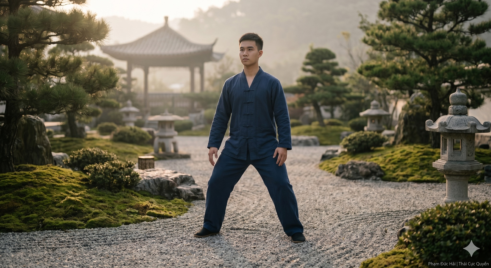

# Trà Và Tĩnh Lặng (Phần III)

> 📅 *Thứ Ba 02/06/2026 14:11* · 📸 1 ảnh

[← Quay lại danh sách bài viết](../index.md)

---

Người học trò gặp gương

Ba tuần trôi qua.
Minh đến thiền thất đều đặn mỗi sáng thứ Bảy. Nhưng hôm nay anh đến vào buổi chiều, bất thường, mặt có vẻ nặng nề hơn mọi khi. Không phải nặng nề vì buồn. Nặng nề theo kiểu một người vừa va phải điều gì đó mà không biết gọi tên là gì.
Vô Ngôn đang ngồi vá lại một chiếc túi vải cũ bằng kim chỉ. Đôi tay già nua di chuyển chậm rãi, đều đặn, không nhìn xuống vải mà vẫn chính xác từng mũi kim.
Minh ngồi xuống, nhìn đôi tay đó một lúc trước khi lên tiếng.

Minh: Thầy ơi, con có chuyện muốn kể.
Vô Ngôn: (không ngừng tay) Kể đi.
Minh: Hôm qua con dạy Thái Cực cho một người bạn. Anh ta mới bắt đầu học, chưa biết gì cả. Con bắt đầu giải thích tấn pháp, giải thích về trọng tâm, về cách thở. Và con nhận ra mình đang nói rất nhiều. Rất nhiều từ ngữ, rất nhiều khái niệm. Người bạn đó nhìn con với vẻ mặt bối rối ngày càng tăng.
Vô Ngôn: Rồi sao?
Minh: Con dừng lại. Con nhớ đến Thầy. Con nhớ đến bà cụ sáu mươi lăm tuổi trong câu chuyện Thầy kể. Và con thử làm khác đi. Con không nói nữa. Con chỉ đứng bên cạnh anh ta và... bắt đầu chuyển động. Chậm thôi. Con không giải thích. Chỉ chuyển động.
Vô Ngôn: Và anh ta?
Minh: (ngập ngừng) Anh ta bắt đầu nhại theo. Không hoàn hảo, nhưng có gì đó đúng hơn hẳn so với lúc con giải thích bằng lời. Và con cảm thấy... kỳ lạ lắm Thầy. Con cảm thấy vui, nhưng đồng thời lại bất an.
Vô Ngôn: (dừng mũi kim, nhìn lên lần đầu tiên) Bất an vì sao?
Minh: Vì con không giải thích được tại sao cách đó lại hiệu quả hơn. Con không có lý thuyết để bào chữa cho sự lựa chọn đó. Con chỉ... cảm thấy đó là điều đúng phải làm lúc đó.

(Vô Ngôn đặt chiếc túi vải xuống. Ông nhìn Minh một lúc, như người thợ kim hoàn nhìn một viên đá vừa được cắt lộ ra mặt sáng đầu tiên.)
Vô Ngôn: Con biết con vừa mô tả điều gì không?
Minh: Trực giác?
Vô Ngôn: Gần hơn. Con vừa mô tả khoảnh khắc kiến thức tan vào trong người. Không còn là thông tin nằm trên bề mặt. Nó đã xuống sâu hơn. Và vì nó xuống sâu rồi, nó không cần được gọi tên trước khi hoạt động.
Minh: Nhưng tại sao con lại bất an? Đáng lẽ con phải vui chứ?
Vô Ngôn: Vì tâm trí con đã quen với một trật tự cũ. Trật tự đó là: hiểu bằng lý trí trước, rồi mới hành động. Khi hành động đến trước, tốt hơn lý trí giải thích, tâm trí cũ cảm thấy bị đe dọa. Nó không biết mình còn cần thiết không.
Minh: (chậm rãi) Thầy muốn nói... lý trí đang ghen tị với trực giác?
Vô Ngôn: (khẽ cười) Không hẳn ghen tị. Nhưng lý trí là một người quản lý đã làm việc một mình quá lâu. Bỗng nhiên có một người đồng nghiệp mới xuất hiện, làm việc nhanh hơn và hiệu quả hơn trong một số tình huống. Người quản lý đó chưa biết phải xếp người đồng nghiệp mới vào vị trí nào trong bộ máy.

Minh: Thầy ơi, con muốn hỏi thẳng một điều. Trực giác và trí tuệ đích thực có phải là một không?
Vô Ngôn: (đứng dậy, bước ra sân, ra hiệu cho Minh đi theo) Ra đây.
(Hai thầy trò đứng giữa sân. Nắng chiều nghiêng dài, đổ bóng hai người lên mặt gạch cũ.)
Vô Ngôn: Con hãy đứng vào tấn. Bất kỳ tấn nào con thấy tự nhiên.
(Minh đứng vào tấn Mã Bộ, hai chân rộng bằng vai, gối hơi khuỵu, tay thả lỏng hai bên.)
Vô Ngôn: Tốt. Bây giờ Thầy hỏi, con trả lời bằng cơ thể, không bằng lời. Trọng tâm của con đang ở đâu?
(Minh không nói. Anh nhắm mắt lại, chú ý vào lòng bàn chân. Sau vài giây, anh dịch chuyển nhẹ, trọng lượng về phía sau một chút.)
Vô Ngôn: Đó là trực giác cơ thể. Nhanh, trực tiếp, không qua trung gian ngôn ngữ. Bây giờ, con hãy mở mắt ra và giải thích cho Thầy nghe tại sao con vừa dịch trọng tâm ra sau.
Minh: (mở mắt, suy nghĩ) Vì... lòng bàn chân trước đang chịu lực nhiều hơn bình thường. Có lẽ do hông con hơi nghiêng về trước khi đứng vào tấn.
Vô Ngôn: Đó là lý trí phân tích. Chậm hơn, có ngôn ngữ, có cấu trúc. Hai thứ đó khác nhau. Nhưng con thấy chúng mâu thuẫn nhau không?
Minh: Không. Chúng... nói về cùng một sự việc, chỉ theo hai ngôn ngữ khác nhau.
Vô Ngôn: Đúng vậy. Trực giác và lý trí không phải kẻ thù. Chúng là hai mắt. Nhắm một mắt thì vẫn nhìn thấy, nhưng mất chiều sâu. Trí tuệ đích thực là khi cả hai mắt cùng mở, cùng nhìn về một hướng, không mắt nào cố lấn át mắt kia.

(Họ trở vào trong. Vô Ngôn pha thêm trà. Lần này ông để Minh tự rót cho mình.)
Minh: Thầy ơi, con muốn kể tiếp câu chuyện hôm qua. Sau khi dạy bạn xong, tối đó con ngồi một mình và bắt đầu tự hỏi: bao nhiêu thứ khác trong cuộc sống mà con cũng đang làm theo kiểu cũ? Không chỉ trong tập luyện. Mà cả trong công việc, trong các mối quan hệ.
Vô Ngôn: Và con tìm thấy điều gì?
Minh: (giọng chùng xuống) Con nhận ra mình hay nghe người khác nói chuyện nhưng thật ra đầu óc đang chuẩn bị câu trả lời. Không thật sự lắng nghe. Chỉ thu thập thông tin đủ để phản hồi. Giống như đọc sách để ghi chép, không phải để hiểu.
Vô Ngôn: Phát hiện đó làm con cảm thấy thế nào?
Minh: Xấu hổ một chút. Nhưng cũng thấy nhẹ. Vì ít nhất là thấy được.
Vô Ngôn: Xấu hổ là phản ứng của cái tôi khi bị nhìn thấu. Nhẹ nhàng là phản ứng của tâm trí khi được trút bỏ một lớp giả dối. Cái nào đến trước không quan trọng. Điều quan trọng là con không trốn tránh cái nhìn đó.
Minh: Thầy có bao giờ trốn tránh không?

(Một câu hỏi bất ngờ. Minh tự ngạc nhiên vì mình dám hỏi. Vô Ngôn cũng có vẻ không mong đợi câu này. Nhưng ông không né.)
Vô Ngôn: Có. Nhiều năm. Thầy từng tin rằng tu tập là việc tích lũy công phu, tích lũy giờ ngồi thiền, tích lũy kinh điển đã đọc qua. Thầy đi hết thiền viện này đến thiền viện khác, gặp hết thầy này đến thầy khác. Mỗi lần về thì đầu óc nặng thêm một ít, nhưng trong lòng vẫn còn một thứ gì đó chưa yên.
Minh: Thầy tìm ra điều đó khi nào?
Vô Ngôn: Khi Thầy bệnh nặng, nằm một chỗ ba tháng, không đọc được sách, không ngồi thiền được vì đau lưng, không đi đâu được. Tất cả những thứ Thầy tích lũy bỗng nhiên không dùng được. Và Thầy mới nhận ra: trong ba tháng đó, Thầy vẫn thở. Vẫn nghe tiếng mưa. Vẫn cảm nhận được hơi ấm của nắng chiều qua khung cửa sổ. Những thứ đó không cần tích lũy. Chúng luôn ở đó, chỉ chờ Thầy ngừng chạy đủ lâu để nhận ra.
Minh: (khẽ) Bệnh trở thành người thầy.
Vô Ngôn: Mọi thứ đều có thể trở thành người thầy. Nếu con sẵn sàng học theo kiểu không biết thay vì kiểu đã biết.

Minh: Thầy ơi, con muốn hỏi về một khái niệm mà con đọc được. Shoshin trong tiếng Nhật, tâm của người mới bắt đầu. Con hiểu về mặt lý thuyết. Nhưng làm thế nào để thật sự sống với nó? Không phải chỉ biết về nó?
Vô Ngôn: Con đang hỏi câu đó với tâm trạng gì?
Minh: (dừng lại) Với tâm trạng... của người đã biết khái niệm đó và muốn tìm hiểu thêm về nó.
Vô Ngôn: Nghĩa là con đang hỏi về Shoshin bằng tâm thế của người không có Shoshin.
(Minh dừng lại. Rồi bật cười. Lần đầu tiên trong buổi chiều hôm đó anh cười thật sự.)
Minh: Thầy vừa dùng câu hỏi của con để trả lời câu hỏi của con.
Vô Ngôn: Không phải Thầy trả lời. Con tự nhìn thấy. Thầy chỉ đứng im.

(Ánh nắng chiều đã chuyển sang vàng sẫm. Bóng cây tre kéo dài qua sân, chạm đến chân bàn nơi hai thầy trò đang ngồi.)
Minh: Thầy ơi, con muốn hỏi điều cuối cùng hôm nay. Suốt ba tuần nay con tập Vân Thủ mỗi sáng. Và con nhận thấy có những buổi sáng bài quyền rất tốt; trọng tâm ổn định, hơi thở đều, tay chuyển động như tự nó biết đường. Nhưng cũng có những buổi sáng mọi thứ rời rạc hết, đầu óc đầy tạp niệm, tay thì cứng. Con không hiểu tại sao lại có sự khác biệt lớn như vậy giữa hai ngày. Con đang làm đúng hay sai?
Vô Ngôn: Con hỏi câu đó như thể tập luyện là một cái máy cần được hiệu chỉnh cho đến khi chạy ổn định mỗi ngày.
Minh: Không phải vậy sao?
Vô Ngôn: Con là người, không phải máy. (ông nhìn ra cửa sổ, ra khoảng trời đang chuyển màu) Con thấy bầu trời không? Sáng nay trong vắt. Chiều nay mây kéo đến. Ngày mai có thể mưa. Bầu trời đó đang hoạt động đúng hay sai?
Minh: Nó chỉ đang... là chính nó.
Vô Ngôn: Những buổi sáng quyền pháp tốt, những buổi sáng rời rạc; tất cả đều là bầu trời của con hôm đó. Cả hai đều là thật. Cả hai đều cần thiết. Buổi sáng rời rạc không phải thất bại; đó là bầu trời đang xử lý những gì xảy ra bên trong. Nếu con luôn đòi hỏi bầu trời phải trong vắt, con sẽ không bao giờ học được cách di chuyển trong mây.
Minh: (thở ra nhẹ nhàng) Con đang đòi hỏi sự hoàn hảo nhất quán từ một quá trình vốn dĩ không nhất quán.
Vô Ngôn: Không chỉ trong tập luyện. Trong cuộc sống cũng vậy. Người ta thường nghĩ trí tuệ là trạng thái ổn định, đạt được một lần rồi giữ mãi. Thật ra trí tuệ giống nước hơn; nó chảy, nó thay đổi hình dạng theo địa hình, có lúc êm, có lúc xiết. Nhưng bản chất của nó vẫn là nước.

(Vô Ngôn đứng dậy, nhặt chiếc túi vải lên, tiếp tục vá những mũi kim còn dở.)
Minh: Thầy ơi, con để ý Thầy vá chiếc túi đó từ lúc con đến đến giờ. Nó cũ lắm rồi, mua cái mới có lẽ dễ hơn.
Vô Ngôn: (không ngừng tay) Có lẽ vậy.
Minh: Nhưng Thầy vẫn vá.
Vô Ngôn: Vì Thầy thích vá. Mỗi mũi kim là một lần chú ý. Không nghĩ về mũi kim trước. Không lo về mũi kim sau. Chỉ mũi kim này, sợi chỉ này, lỗ thủng nhỏ này trước mắt. (ông ngước nhìn Minh) Con biết đây là bài tập gì không?
Minh: (mỉm cười) Thiền.
Vô Ngôn: Thiền không chỉ xảy ra trên tọa cụ. Thái Cực không chỉ xảy ra trong sân tập. Cái Tùng, cái Hư Tâm, cái hiện diện trọn vẹn đó; nếu nó không theo con vào bếp, vào công việc, vào cuộc trò chuyện với vợ con tối nay, thì nó chỉ là màn trình diễn, không phải sự hiểu biết thật.

(Minh ngồi im một lúc. Ánh đèn trong thiền thất bắt đầu sáng lên khi trời dần tối.)
Minh: Thầy ơi, con nghĩ con hiểu ra điều gì đó hôm nay. Tích lũy kiến thức là việc con nhặt thật nhiều viên đá bỏ vào túi. Trí tuệ đích thực là lúc con không cần mang túi nữa, vì con biết cách nhìn đất dưới chân và tìm đúng viên đá cần thiết đúng lúc cần thiết.
(Vô Ngôn dừng tay vá. Ông nhìn Minh khá lâu, không nói gì. Rồi ông đặt chiếc túi vải xuống, chậm rãi vỗ hai tay vào nhau phủi đi những sợi chỉ vụn.)
Vô Ngôn: (giọng nhẹ, gần như chỉ nói với chính mình) Tuần sau đừng đến nữa.
Minh: (giật mình) Thầy... con làm gì sai không?
Vô Ngôn: Không. Nhưng câu con vừa nói đó; nếu con đến đây tuần sau, Thầy sẽ nói thêm, và những điều Thầy nói sẽ bắt đầu xây chồng lên trên câu đó, làm nó nặng hơn thay vì sáng hơn. Hãy về. Hãy sống với điều con vừa tự tìm ra. Hãy để nó thở. Đừng vội lấp nó bằng thêm một bài học nữa.
Minh: (đứng dậy, nhìn Thầy với ánh mắt vừa ngạc nhiên vừa biết ơn) Thầy đang dạy con bằng cách... ngừng dạy.
Vô Ngôn: (quay lại với chiếc túi vải, mũi kim lại tiếp tục di chuyển) Con đã biết câu trả lời. Thầy chỉ là người hỏi câu hỏi.

Minh bước ra cổng. Lần này không có vũng nước để dừng lại nhìn. Chỉ có con đường nhỏ dẫn về nhà, những bóng đèn vàng bắt đầu thắp lên dọc hai bên đường, và trong ngực anh, một cái gì đó không có tên, không cần tên, đang lặng lẽ hiện diện.
Anh không nghĩ về bài học hôm nay. Anh không ghi chép lại trong đầu. Anh chỉ đi. Từng bước một. Lòng bàn chân chạm mặt đường. Hơi thở vào, hơi thở ra.
Và lần đầu tiên sau nhiều năm, con đường về nhà cảm thấy đủ rồi.

"Vi học nhật ích, vi Đạo nhật tổn. Tổn chi hựu tổn, dĩ chí ư vô vi. Vô vi nhi vô bất vi."
Theo đuổi cái học thì mỗi ngày một thêm. Theo đuổi cái Đạo thì mỗi ngày một bớt. Bớt rồi lại bớt, cho đến khi đạt đến vô vi. Vô vi mà không có gì là không làm được. - Lão Tử, Đạo Đức Kinh, Chương 48 -