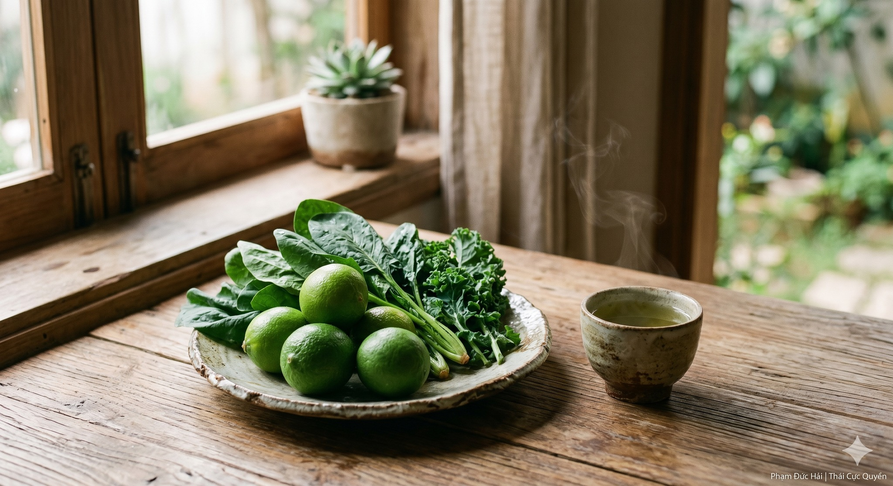

# ĂN GÌ ĐỂ DƯỠNG GÂN? (GÓC NHÌN NỘI KINH)

> 📅 *Thứ Năm 28/05/2026 09:22* · 📸 1 ảnh

[← Quay lại danh sách bài viết](../index.md)

---

Gân cốt dẻo dai
không chỉ do tập
mà còn do dưỡng
từ nguồn thực phẩm
nuôi mạng sống mỗi ngày

CAN CHỦ GÂN

Trong Hoàng Đế Nội Kinh
"Can chủ về gân"
Gan khỏe thì gân nhuận
Gan yếu gân sẽ khô
dễ dẫn đến co rút
vận động khó khăn

VỊ CHUA VÀ SỰ NHUẬN

Vị chua thuộc về Can
đi thẳng vào gân
Một chút vị chua nhẹ
giúp gân được thu liễm
giữ được sự đàn hồi
nhưng đừng dùng quá nhiều
làm gân bị co quắp

HUYẾT NUÔI DƯỠNG

"Can tàng huyết"
Huyết có đầy đủ
thì gân mới được tưới tẩm
Hãy chọn thực phẩm màu xanh
như rau lá đậm
để bổ trợ cho Can khí
giúp gân luôn tươi mới

DƯỠNG TỲ ĐỂ THÔNG GÂN

Tỳ vị vận hóa tốt
thì dưỡng chất mới đến gân
Tránh đồ lạnh, đồ sống
làm tắc nghẽn dòng chảy
Để gân luôn mềm mại
như nhành liễu trước gió

CHO NÊN

Ăn đúng là dưỡng gân.
Tập đúng là thông mạch.
Thân tâm hòa hợp
từ miệng ăn đến bước đi.

Phạm Đức Hải | Thái Cực Quyền