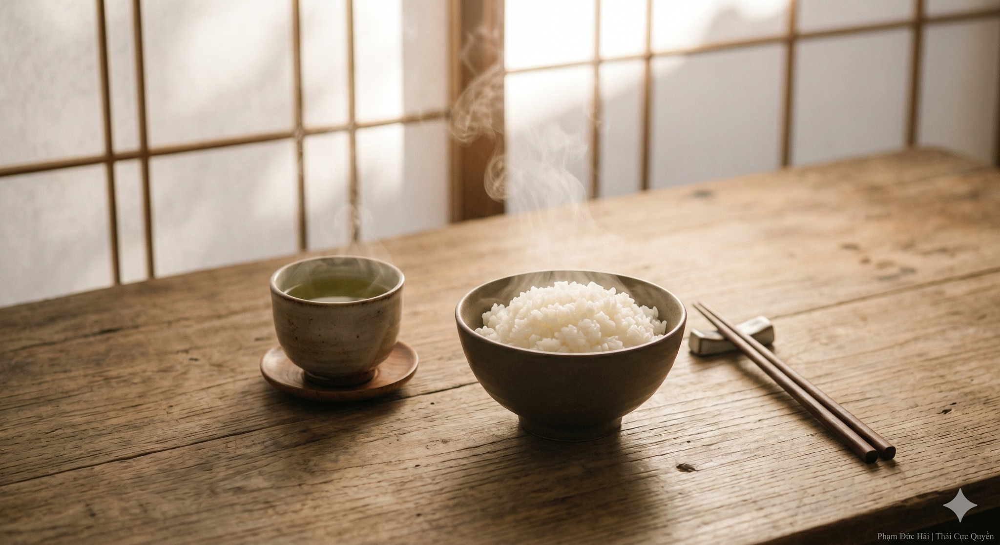

# ĂN UỐNG THUẬN TỰ NHIÊN ĐỂ DƯỠNG GỐC

> 📅 *Thứ Năm 28/05/2026 08:05* · 📸 1 ảnh

[← Quay lại danh sách bài viết](../index.md)

---

Nhiều người mải mê
tìm thuốc bổ đắt tiền
nhưng lại quên mất
cỗ máy chuyển hóa
quan trọng nhất đời mình
đó chính là Tỳ Vị

HẬU THIÊN CHI BẢN
Trong Hoàng Đế Nội Kinh
Tỳ Vị là gốc
của sự sống sau sinh
Mọi thức ăn thức uống
đều phải qua đây
để hóa thành Khí Huyết
nuôi dưỡng toàn thân

NHAI KỸ LÀ DƯỠNG KHÍ
Đừng ăn vội vàng
làm khổ Tỳ Vị
Nhai kỹ là bước
chuyển hóa đầu tiên
giúp Khí được lưu thông
giúp Vị không mệt mỏi
Vận hành rất tự nhiên

TRÁNH XA ĐỒ LẠNH
Dương khí cần ấm
Tỳ vị sợ hàn
Đồ lạnh làm co rút
làm bít lấp đường thông
Khi bụng bị lạnh
Khí sẽ bị trệ
Huyết sẽ bị ứ
sinh ra vạn thứ bệnh

ĂN THEO NHỊP ĐẤT TRỜI
Sáng ăn như vua
Trưa ăn như bạn
Tối ăn như kẻ thù
Thuận theo nhịp sinh học
để Dương khí phát ra
để Âm huyết thu lại
Giữ vững hệ trục bên trong

CHO NÊN
Ăn đúng là dưỡng sinh.
Nhai kỹ là tích khí.
Tỳ vị khỏe thì thân mới bền.

Phạm Đức Hải | Thái Cực Quyền